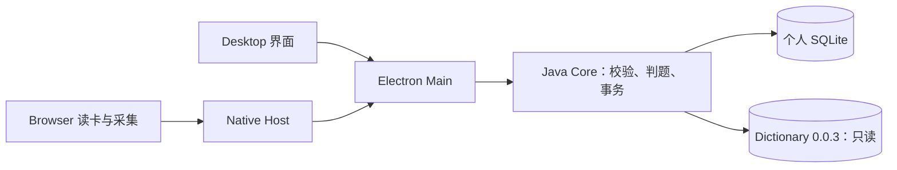

# LexiMeet Desktop Core

[GitHub](https://github.com/leximeet/leximeet-desktop-core) · [Gitee](https://gitee.com/leximeet/leximeet-desktop-core)

GitHub 与 Gitee 是平级的代码、问题反馈和贡献入口。正式版本使用相同提交与附件校验和，下载前按[发布与验收](docs/发布与验收.md)核对来源；仓库已有源码不表示已经发布安装物。

**Core 负责词遇桌面的本机学习和资料事务。** 公共词典只读，个人资料保存在 SQLite；练习、遇见、学习规划和插件连接共用同一个权威工作区。

`Java 21` · `Spring Boot 3.5.16` · `SQLite` · `FSRS-6` · `1.0.0 本地正式版本`

本地正式版本已完成对应源码与测试准备，正式标签与发行附件仍待发布。已验证 macOS arm64 / JDK 21；其他平台与签名安装的实际结果另见[发布与验收](docs/发布与验收.md)。

[快速开始](docs/快速开始.md) · [架构设计](docs/架构设计.md) · [功能设计](docs/功能设计.md) · [职责与接口](docs/1.0.0核心职责.md) · [学习规则](docs/统一学习规则.md) · [完整文档](docs/README.md)

<!-- leximeet-diagram: figure-b335630551-01 -->
<picture>
  <source media="(prefers-color-scheme: dark)" srcset="docs/diagrams/rendered/figure-b335630551-01.dark.svg">
  
</picture>

<details>
<summary>查看和编辑 Mermaid 源码</summary>

[图源文件](docs/diagrams/figure-b335630551-01.mmd)



</details>
<!-- /leximeet-diagram -->

## 这里负责什么

| 能力         | 实现                                                                              |
| ------------ | --------------------------------------------------------------------------------- |
| 本机资料     | 稳定词条身份、个人笔记、多词本归属、真实词性筛选、遇见、逻辑回收站                |
| 学习闭环     | 可选目标与计划、默认新学 10 / 复习 20、六种冻结练习、0–30 分状态、FSRS 与提醒题目 |
| 安全采集     | 默认七天同词同语境查重、敏感内容替换 `xxx`、目标所在句最多 500 UTF-16             |
| 本地插件连接 | 发现、用户确认、配对与短会话、只读词卡、原子采集、明确断开与撤权                  |
| 数据可靠性   | 同一 SQLite 事务、稳定操作回执、并发修订、撤销重算、当前格式备份                  |

窗口、声音、剪贴板监听、系统通知投递、Native Messaging 注册由 LexiMeet Desktop（[GitHub](https://github.com/leximeet/leximeet-desktop) / [Gitee](https://gitee.com/leximeet/leximeet-desktop)）完成。Core 没有桌面 UI，也没有云登录或 LMSP 同步入口；这些属于 [2.0.0 路线](docs/路线与任务.md)。

## 构建与验证

安装 JDK 21 和 Maven 3.9+；检查完整产物还需要 Python 3.10+。在仓库根目录运行：

```bash
mvn -B -ntp -gs maven-settings.xml -s maven-settings.xml "-Dmaven.repo.local=.runtime/m2" clean verify
python3 scripts/verify-docs.py
python3 scripts/verify-release.py
```

`verify` 检查排版并执行全部 Java 测试，生成可执行 `target/leximeet-core.jar`、源码 Jar 和 CycloneDX SBOM。产物检查会在本轮临时目录中启动真实 Jar，验证鉴权和读取，再关闭进程并回收资料。测试不读正式用户数据、不修改系统时间、不占用键鼠。更多命令见[开发与测试](docs/开发与测试.md)。

## 阅读与贡献

- 调用 Core 或接入其他宿主：[职责与接口](docs/1.0.0核心职责.md)、[数据模型与备份](docs/数据模型与备份.md)。
- 对齐 Browser 独立学习：[统一学习规则](docs/统一学习规则.md)、[采集安全与重复语境](docs/采集安全与重复语境.md)。
- 修改代码或报告问题：[贡献指南](CONTRIBUTING.md)、[安全政策](SECURITY.md)。
- 准备分发：[发布与验收](docs/发布与验收.md)、[变更日志](CHANGELOG.md)。

个人编辑仅保存笔记和多词本归属，词条与词本通过正式桌面命令写入；旧词条 CRUD 与用户标签管理已移除。边界见 [词库与规划查询](docs/词库与规划查询.md)。

首次正式版使用 schema 100，拒绝打开未发布的 0.x 测试库和结构不同的测试库，不迁移或自动删除文件。初始化和既有结构核验使用同一套定义，不能只凭版本号接纳同号旧实验库。完整备份与安全启动错误见 [数据模型与备份](docs/数据模型与备份.md) 和 [快速开始](docs/快速开始.md)。正式版本之后的数据兼容必须单独设计和验证。Browser 连接时封存自身资料 A，直接使用桌面 B；本地连接不导入或合并 A。

## 许可与致谢

本项目沿用 [GNU AGPL v3](LICENSE)。运行时依赖和词典资源各自保留许可，见[依赖与许可证](docs/依赖与许可证.md)。感谢 Spring、Xerial SQLite JDBC、Jackson、SLF4J、[java-fsrs](https://github.com/open-spaced-repetition/java-fsrs) 和 LexiMeet Dictionary。公共词典内容不因被应用使用而变成应用原创数据。

## 正式下载

[1.0.0 Release](https://github.com/leximeet/leximeet-desktop-core/releases/tag/1.0.0)提供 Jar、源码、SBOM 与校验文件；[本版说明](docs/版本/1.0.0.md)解释交付与三平台验证边界。
