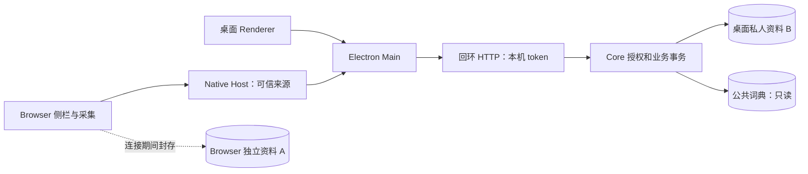
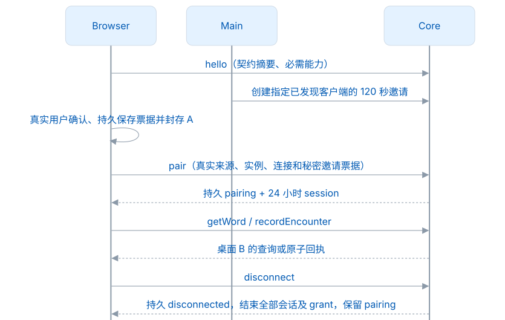
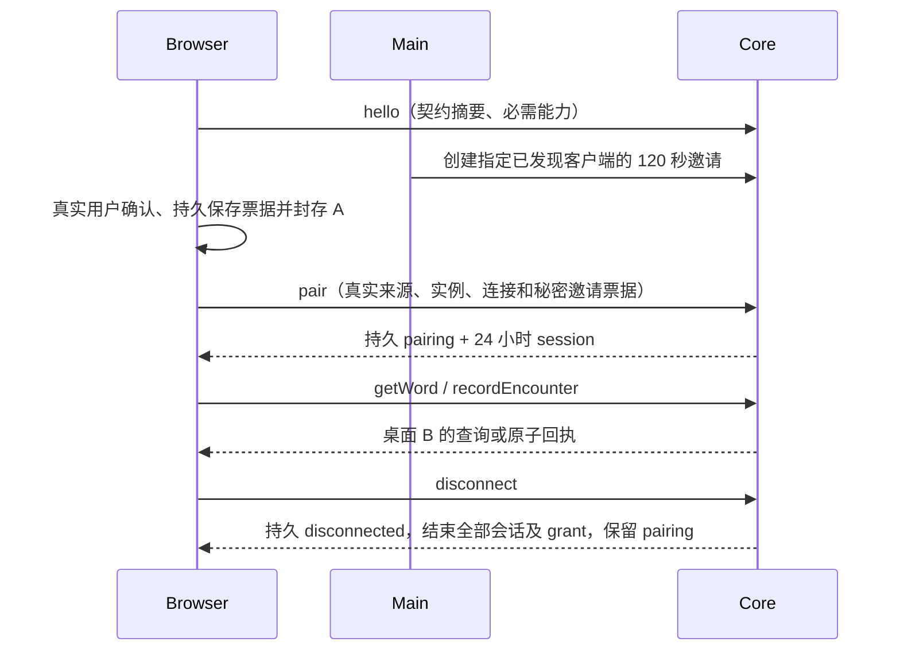
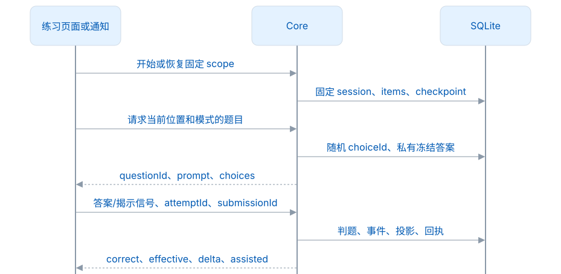
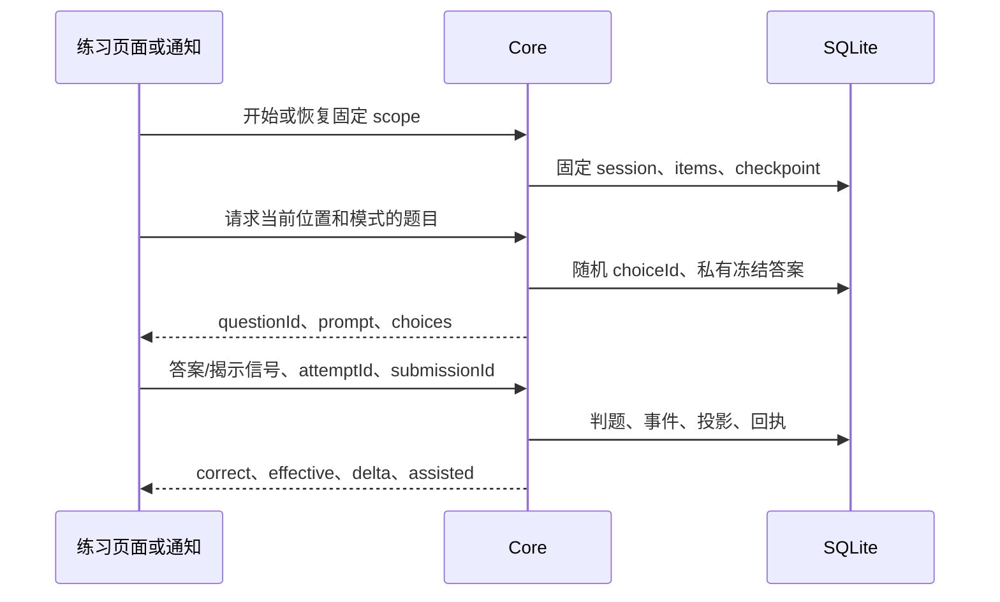

# Desktop Core 1.0.0

首次正式版本及 Git 标签均为 `1.0.0`。首次公开历史保留远端原始 `init commit` 与一个当前结果提交；完整开发历史私有保留，不随公开 main 推送。整理后的源码、冻结来源及产物需重新核验，历史测试不能替代新联合测试，见[发布与验收](发布与验收.md)。

## 工作区与职责

Core 是桌面资料的唯一写入者。Main 负责窗口、声音、剪贴板、系统通知与 Native Messaging；Renderer 展示 Core 的结果。Browser 独立运行时拥有资料 A；连接桌面时封存 A，直接使用桌面资料 B。连接过程中没有导入、上传、合并和接管预览步骤。

<!-- leximeet-diagram: figure-e49ce90392-01 -->
<picture>
  <source media="(prefers-color-scheme: dark)" srcset="diagrams/rendered/figure-e49ce90392-01.dark.svg">
  
</picture>

查看和编辑 Mermaid 源码

[图源文件](diagrams/figure-e49ce90392-01.mmd)

<!-- /leximeet-diagram -->

插件管理页引导用户打开桌面，设置中保留断开入口。临时失联时只能重连，不能自动写回 A；用户明确断开后恢复 A，独立账号仍保持退出状态。配对保留，下一次须重新发起邀请并由插件确认。LMSP、账号、跨设备云同步属于 2.0.0。

## 资料身份与读模型

- schema 100 直接初始化；旧版本、同版本不同结构、无版本的既有文件拒绝打开。不修补、不迁移、不删除。
- 公共词使用 `WordRef {kind:dictionary,entryId,release,entrySchema:leximeet.entry.v2}`。entryId 来自 Dictionary；自定义词使用 customId UUID、headword、language=en。词头是显示与检索内容，不是跨端主键。
- 来源 WordRef 单独保存在 `desktop_word_identity`；安装新版公共词典不会擅自改写旧事实的 release。请求的版本不可用时返回 missing 或 RESOURCE_UNAVAILABLE，私人笔记、关系和遇见仍保留。
- 公共资源只读，私人笔记、词本成员和收集状态另存。相同词头的公共词及多个 customId 保留不同身份。
- LMCP 只暴露 reading-domain 的词卡、状态摘要和遇见事件。学习计划、冻结题、草稿、FSRS 向量及完整私人实体不通过 LMCP 暴露。
- Desktop 内部保留完整学习实体与事件。未来 LMSP 的领域结构位于 `resources/domain`，与冻结的 LMCP reading Schema 分开；不是已启用云同步。
- 修订和逻辑序号是最多 40 位的十进制串，不能转换成 Java long。分页游标绑定查询、配对、世代和修订，有效期 5 分钟；资料改变返回 CURSOR_EXPIRED。

## 配对、会话和幂等

<!-- leximeet-diagram: figure-e49ce90392-02 -->
<picture>
  <source media="(prefers-color-scheme: dark)" srcset="diagrams/rendered/figure-e49ce90392-02.dark.svg">
  
</picture>

查看和编辑 Mermaid 源码

[图源文件](diagrams/figure-e49ce90392-02.mmd)

<!-- /leximeet-diagram -->

持久 pairing 与短期 session 分开管理。session 绑定来源、connectionId、两端实例、workspaceId、generation 和 authorizationEpoch；续签不延长旧 session。Core 重启使旧 session 和 host grant 失效，持久配对和业务回执保留；resume 校验真实来源和持久凭据后签发新 session。完整撤权会递增 epoch，使所有旧凭据失效，并停止旧回执读取。

读取租约最长 30 秒且不晚于 session 到期。`getChanges` 比较 revision，返回 changed 和新读取租约，不提供完整实体变更日志。

每个写请求的 mutationId 绑定配对、epoch、方法和规范化参数摘要。原 mutation 重放返回原回执；同 ID 更换参数返回 IDEMPOTENCY_KEY_REUSED。不同 mutation 使用同 eventId 时，采集内容相同仍返回原遇见回执，内容不同返回 EVENT_ID_REUSED。新词、词本关系、遇见、修订和回执在同一 SQLite 事务内提交；失败整笔回滚，并保留 rejected 操作回执。

采集只接受 collect，来源为 web 或 manual。网页地址必须是无凭据和 fragment 的 HTTP/HTTPS；原文/摘录的范围使用 UTF-16 半开下标，准确指向 surface，不能切开代理对。发生时间、学习时区和事件来源由桌面生成；插件不能伪造桌面学习事实。已有个人笔记不会被一次空采集备注覆盖。新增活动词仍受个人词库 10,000 词上限约束。

采集默认先脱敏，再取目标所在的安全句（最多 500 UTF-16），并在事务内阻止七天内同词同语境的重复写入。`getWorkspace.capturePolicy` 与采集回执政策快照属于安全扩展字段；没有增加远程设置或学习接口。重复返回 `duplicate-context` 与已有实体的安全投影，不新增收藏、备注、修订或成功通知，见[采集安全与重复语境](采集安全与重复语境.md)。

## LMCP 方法与可选宿主能力

| 类别     | 方法                                                                                                        | 能力                 |
| -------- | ----------------------------------------------------------------------------------------------------------- | -------------------- |
| 连接     | hello、requestConnection、getConnectionStatus、pair、resumeSession、renewSession、revokePairing、disconnect | lmcp.connection/1    |
| 读取     | getWorkspace、matchWords、getWord、getPublicEntry、getChanges、getOperation                                 | desktop.reading/1    |
| 采集     | recordEncounter                                                                                             | desktop.capture/1    |
| 跳转     | openInDesktop                                                                                               | desktop.navigation/1 |
| 可选词本 | listNotebooks                                                                                               | desktop.notebooks/1  |
| 可选遇见 | listEncounters                                                                                              | desktop.encounters/1 |
| 可选宿主 | registerHost                                                                                                | host.registration/1  |

16 个必需方法和 3 个可选方法均已注册并实际实现；没有可选能力不影响基础读卡和采集。registerHost 仅接受 browser/1 已定义的五种能力，grant 最长 10 分钟并绑定完整 owner 和实际连接。Desktop Main 执行双向宿主调用与权限检查；Java Core 不访问浏览器标签页。

每个请求/成功结果使用随包 Schema 实际校验。单帧上限 256 KiB。锁定协议 packageVersion `1.0.0`，contractDigest `61a44cc2f7f73fef81b007c844e1f2fa4deb955bf21a69236ee7b4f713808c49`。规范来源为 `leximeet-connector-protocol` 的 `1.0.0` 标签，实际 `sourceCommit`、来源版本和逐文件摘要由 [src/main/resources/lmcp/source.json](../src/main/resources/lmcp/source.json) 记录；启动验证规范清单及逐文件 SHA-256，不在运行时下载或偷偷替换 Schema。

固定构建身份和判断运行时兼容性是两件事：本次构建严格验证自己的 17 项规范原字节；正式连接按 API 主版本、客户端最低服务版本和实际必需能力协商，不能因对端正式版摘要不同而拒绝。任一方的合同为预发布时，候选版本与摘要都必须完全一致；首次正式版仍拒绝旧 rc。`hello` 不授予私人资料读取权限，之后仍须真实用户确认和完整会话校验。

以当前服务 API `1.0.0` 为例：

| 客户端声明                                                  | 结果     | 原因                             |
| ----------------------------------------------------------- | -------- | -------------------------------- |
| 正式合同 `1.0.1` 或 `1.1.0`，最低 API `1.0.0`，必需能力齐全 | 可以连接 | 更新交付摘要不改变依赖的基础接口 |
| 最低 API `1.0.1`                                            | 拒绝     | 本机服务未达到最低要求           |
| 最低 API `0.9.0` 或 `2.0.0`                                 | 拒绝     | API 主版本不同                   |
| 请求未知必需能力                                            | 拒绝     | 不能以忽略能力伪装可用           |
| 合同 `1.0.0-rc.6`                                           | 拒绝     | 预发布候选不能接入正式版         |

请求仍严格校验字段、类型和连接身份，响应返回本机自己的已验证版本与摘要；不抄取客户端摘要。

上一快照摘要 `f0626e9fff824b9b9821bfda65cfc02d57341371c2fb87a8c1eed27e66c98f41` 仅保留为历史记录。当前更新补齐既有控制方法与插件确认位置的规范说明，不改 19 方法、Schema 或学习规则；正文原字节参与摘要，因此消费产物须重新构建与验证。

## Main 私有接口

这些接口仅监听回环，要求启动时独立生成的 Core token，并拒绝网页 Origin。Core token 不暴露给 Renderer 或 Browser。它和 LMCP 的协议身份不是同一个凭据。

| 入口                      | 责任                                         |
| ------------------------- | -------------------------------------------- |
| POST /api/desktop/query   | 本机资料、计划预览、冻结队列、题目和草稿适配 |
| POST /api/desktop/command | 本机业务事务、完整学习事实写入               |
| POST /api/lmcp/rpc        | Main 传入真实来源，执行冻结 LMCP             |
| POST /api/lmcp/manage     | 发现、邀请、设备摘要、断链、撤权和导航确认   |

本机设置中的 `pluginCaptureNotificationsEnabled` 默认 `true`，只接受布尔值，并在重启和当前格式的资料备份中保留。它由 Main 消费，用于控制插件采集成功的系统通知；不是插件可更改的授权，也不进入 LMCP 读取 DTO。关闭通知不会取消采集或改变学习状态。

`recordEncounter` 的成功响应在 SQLite 事务提交后返回，单次表示一个遇见事件。重放原 mutationId，或不同 mutationId 使用相同 eventId，都可能返回同一原回执，响应没有「首次写入」标志。领域回执的 `result.entity.entityId` 等于 eventId，不能读取不存在的 `entity.id`。Main 可在真实 Core 请求完成时按资料空间、世代和此 entityId 去重提示；不能仅按请求 ID 或 mutationId 计数。提示只需要插件安全名称与成功数量，不需要原文、单词正文、票据或账号。

RPC 包装为 `{envelope,extensionOrigin,connectionId}`。真实 extensionOrigin 从 Native Host 连接参数产生，不能信任请求正文自报的来源。标准 envelope 包含 apiMajor、requestId、connectionId、method、params 和 authorization。

| manage action      | 输入                                                       | 行为                                                                                                                          |
| ------------------ | ---------------------------------------------------------- | ----------------------------------------------------------------------------------------------------------------------------- |
| state              | 无                                                         | clients（含 connectionState）与 discoveredClients（名称、clientInstanceId、origin、connectionId、lastSeenAt、无秘密邀请摘要） |
| requestConnection  | clientInstanceId，可选 origin                              | 向指定已发现客户端发起 120 秒邀请，无 token 响应                                                                              |
| cancelInvitation   | invitationId                                               | 取消尚未接受的邀请；已接受时拒绝，改用 disconnect                                                                             |
| disconnect         | clientInstanceId                                           | 持久标记明确断开、结束全部会话与 grant，保留 pairing、禁止自动恢复                                                            |
| connectionClosed   | connectionId                                               | 只结束这条 Native 连接                                                                                                        |
| revoke             | pairingId 或 clientInstanceId                              | 完整撤销配对                                                                                                                  |
| completeNavigation | pairingId、mutationId、connectionId、deliveryToken、opened | 核验 owner 后保存真实导航结果                                                                                                 |

`openInDesktop` 首次保存 pending 回执，并给 Main 一个私有的一次性 navigationDelivery。Main 等待 Renderer 接受固定页面路由，再通过 completeNavigation 确认；最终 opened 以该回执为准。重复 mutation、重启后 pending 查询都不会重新派发导航。失败或超时不会冒称已打开。word 目标同时提供真实 uiWordId 和 uiSearchTerm，便于本机检索和定位；这两个字段不是跨端词条身份。

## 本机练习

<!-- leximeet-diagram: figure-e49ce90392-03 -->
<picture>
  <source media="(prefers-color-scheme: dark)" srcset="diagrams/rendered/figure-e49ce90392-03.dark.svg">
  
</picture>

查看和编辑 Mermaid 源码

[图源文件](diagrams/figure-e49ce90392-03.mmd)

<!-- /leximeet-diagram -->

practice 恢复 scope 会话；reset=true 开新一轮。practiceWords 返回固定 items；practiceQuestion 使用同一位置/模式题目；practiceSave 保存 checkpoint 和输入。恢复后的判题依据是冻结题和已提交事件，不能把页面自报的 answered/assisted 当作权威证据。换模式不重排词序，新一轮使用新的 attempt 空间；旧事件仍保留。

单词列表首次熟练 +1、不熟悉 −1；默写和填空独立正确 +2，其余独立正确 +1。揭示答案先提交辅助事件，同题不能换 submissionId 再冒充独立得分。普通词卡阅读不扣分；通知最多一题，展示与判题均取同一冻结 DTO。Dictionary v2 的 sentence 例句可以直接出填空题，无需先采集语境；仅 EXERCISE_UNAVAILABLE 跳过并回滚半成品，其他异常原样失败。完整规则见[统一学习规则](统一学习规则.md)。

## 模块和验证范围

| 模块                                                | 职责                                       |
| --------------------------------------------------- | ------------------------------------------ |
| LmcpContract / LmcpRoutes                           | 固定资源完整性、结构校验、19 方法注册      |
| LmcpService                                         | 来源、配对、session、grant、回执、私有管理 |
| LmcpReading / LmcpCursor                            | reading DTO、匹配、原子采集、有界查询      |
| DesktopDataModel                                    | 桌面私人实体、关系、事件身份与学习投影适配 |
| DesktopPracticeSessions / DesktopPracticeCheckpoint | 本机冻结题、会话、输入、继续与新一轮       |
| DesktopLearningReplay                               | 完整学习事件重放、撤销和 FSRS 重建         |
| Desktop* / Personal*                                | 本机页面用例、当前结构与资料恢复           |

Java 测试包括 124 条冻结正反 Schema 样例、实际 SQLite 的授权/幂等/资源换版/同词头身份/采集回滚，以及学习、通知、规划、冻结练习、文件备份和 HTTP 回归。Native 的真实跨进程链路与 Browser 的真实客户端由 Desktop 另外测试；系统通知外观、用户权限和不同平台安装需分别验收。结构完整、单元通过、真实联调和发布许可是不同的证据。

## 自动连接控制

hello 登记当前插件安装实例与安全名称，仅用于发现，不授权读取资料。发现最多 100 个客户端，闲置 60 秒或端口关闭失效；有效控制轮询仅刷新进程内的 lastSeenAt，不续签业务 session，也不修改资料 revision。

任一端都可以发起同一个有期限的邀请；重复发起不延长 120 秒。用户必须在插件真实窗口确认，可信后台先持久保存票据并封存 A，才调用 pair。邀请票据以本机受保护签名密钥生成，服务器仅保存票据哈希和控制回执；长期 pairingToken 单向派生而不保存明文。签名密钥与邀请记录不进入可移动资料备份。

pair 已生效但响应未知时，同一秘密票据可跨新端口/进程恢复同一 pairingCredential，签发当前端口新 session。120 秒仅限制首次接受。明确取消/过期且未接受才恢复 A；网络结果未知仍封存 A，不换邀请、不向 A 写入。

任一端明确 disconnect 持久标记 disconnected，原凭据只能经 getConnectionStatus 查本人控制状态，resumeSession 和旧已应用邀请返回 CONNECTION_ENDED。connectionClosed 仅使当前短会话失效，保留 connected 控制状态供恢复同一 owner。撤权返回独立 revoked 状态，不能恢复业务权限。

当前 Core 的 19 个方法（16 必需、3 可选）使用实际随包 Schema 校验。应用真实确认窗口、系统提示与发现配置由 Desktop/Browser 完成；合同和 Core 测试不代替端到端验收。
