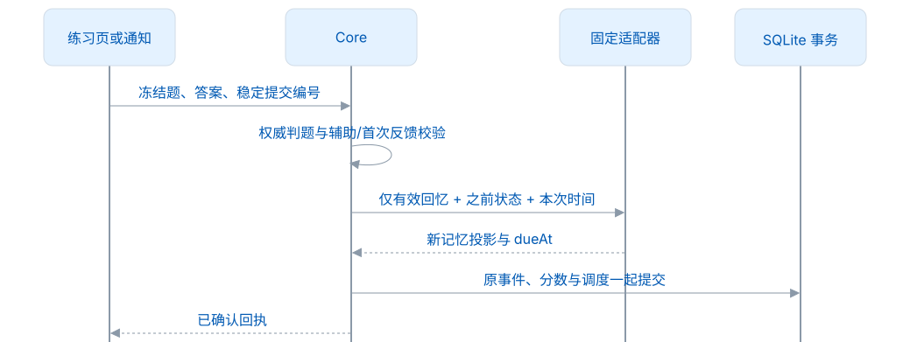
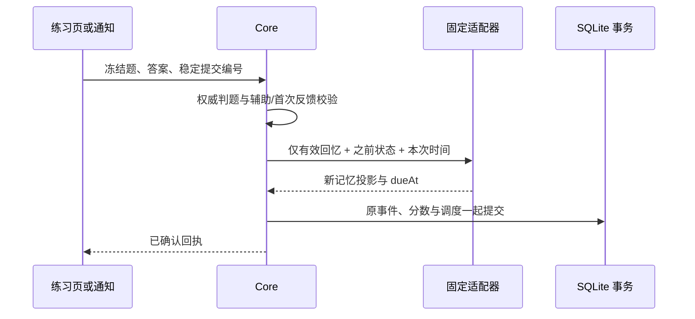

# FSRS 档案与重放

FSRS 不决定词的 0–30 分，也不把“看过词卡”当作一次回忆。Core 先按学习经历确定复习资格，再结合 FSRS 建议时间组成自动队列；主动练习随时可用。完整业务规则见[统一学习规则](统一学习规则.md)。

## 固定档案

| 参数         | 当前值                                                 |
| ------------ | ------------------------------------------------------ |
| 实现         | `io.github.open-spaced-repetition:fsrs:1.0.0` / FSRS-6 |
| 算法标识     | `fsrs-6/java-fsrs-1.0.0`                               |
| 上游源码修订 | `c561ee6c56239b621a0a45b16a6c2e688441eae5`             |
| 目标保持率   | 0.9，是配置目标，不是某用户已达到的真实保持率          |
| 最大间隔     | 36,500 天                                              |
| 学习步骤     | 1 / 10 分钟                                            |
| 重新学习步骤 | 10 分钟                                                |
| 随机模糊     | 关闭，保证相同输入可重放                               |

21 个 FSRS-6 权重固定为：

```json
[
  0.2172, 1.1771, 3.2602, 16.1507, 7.0114, 0.57, 2.0966, 0.0069, 1.5261, 0.112,
  1.0178, 1.849, 0.1133, 0.3127, 2.2934, 0.2191, 3.0004, 0.7536, 0.3332, 0.1437,
  0.2
]
```

持久化与重放使用完整档案，不能只改算法名称或采用“最新默认参数”。当前不训练个人参数；未知版本/不匹配参数拒绝导入。算法升级需要独立的事实重放和兼容方案。

## 记忆状态

S（stability）是模型估计的记忆稳定性，D（difficulty）是估计难度，R 是给定时间的回忆概率估计；它们不是用户自填标签。卡片还保存状态、学习步骤、上次反馈、到期时间和轮次。尚未发生有效回忆时数值可以为空，不能为了补齐字段虚构成功。

<!-- leximeet-diagram: figure-229791f7fc-01 -->
<picture>
  <source media="(prefers-color-scheme: dark)" srcset="diagrams/rendered/figure-229791f7fc-01.dark.svg">
  
</picture>

<details>
<summary>查看和编辑 Mermaid 源码</summary>

[图源文件](diagrams/figure-229791f7fc-01.mmd)



</details>
<!-- /leximeet-diagram -->

临摹、揭示和辅助订正不推进 FSRS；未到期的提前成功不延长已有日程，真实失败可以拉回短期巩固。复习资格已生效的首次独立成功仍计入每日完成量，实时写入与重放均不以 FSRS 到期作为完成条件。保留原始事件、固定 initialDueAt 和前后状态；撤销时从有效事件重建分数、满分周期、完成标记与 FSRS，不只修改一个 dueAt 缓存。

## 跨端一致性

Browser 独立运行时，需要使用相同的 profile、学习步骤、时间精度、事件顺序和有效反馈含义执行黄金向量。表名一致或都叫 FSRS-6 并不足够。连接模式直接使用 Desktop 的读模型，不自行生成第二套桌面记忆状态。跨设备事件导入属于 2.0.0。

`historyHash` 的规范输入、稳定全序和 `asOf` 见[统一规则](统一学习规则.md)；自然衰减不是 again 回忆事件，不写虚构失败。时钟回退可读投影，但不允许追加早于该词最后事件的练习。

## 回归向量

[FsrsSchedulingServiceTest](../src/test/java/app/leximeet/core/FsrsSchedulingServiceTest.java) 固定上游 13 次反馈 `good × 6, again × 2, good × 5` 的天数序列：

```text
[0,4,14,45,135,372,0,0,2,5,10,20,40]
```

另一组 memo 断言 S=49.4472、D=6.8271，容差 0.0001。此测试验证适配器数值；[LearningV2Test](../src/test/java/app/leximeet/core/LearningV2Test.java) 与真实 SQLite/七日测试验证产品资格、完成量和事件关系。[DesktopLearningReplayTest](../src/test/java/app/leximeet/core/DesktopLearningReplayTest.java) 用真实记忆日程和撤销事务确认提前合格练习计数、同词去重、负向资格边界及重放前后一致。这些测试均针对当前学习模型；没有并行的旧 plan/task 规则。
