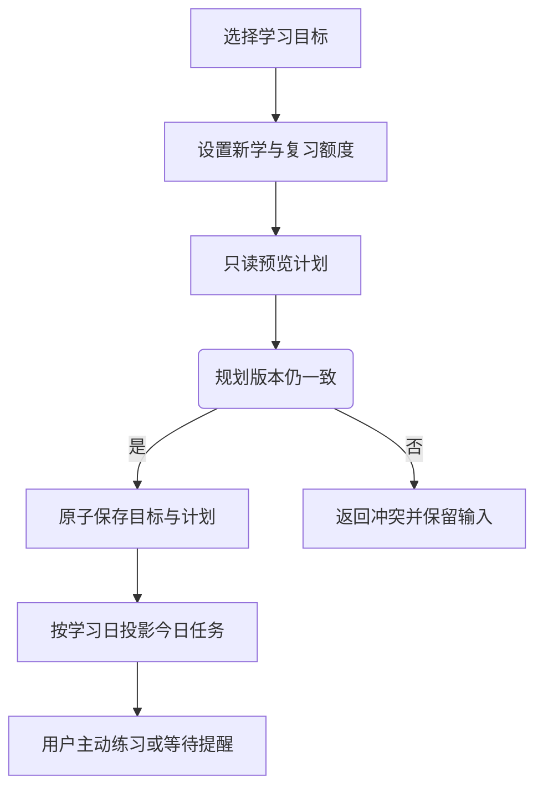
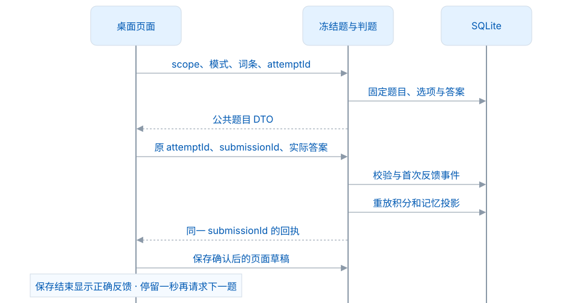
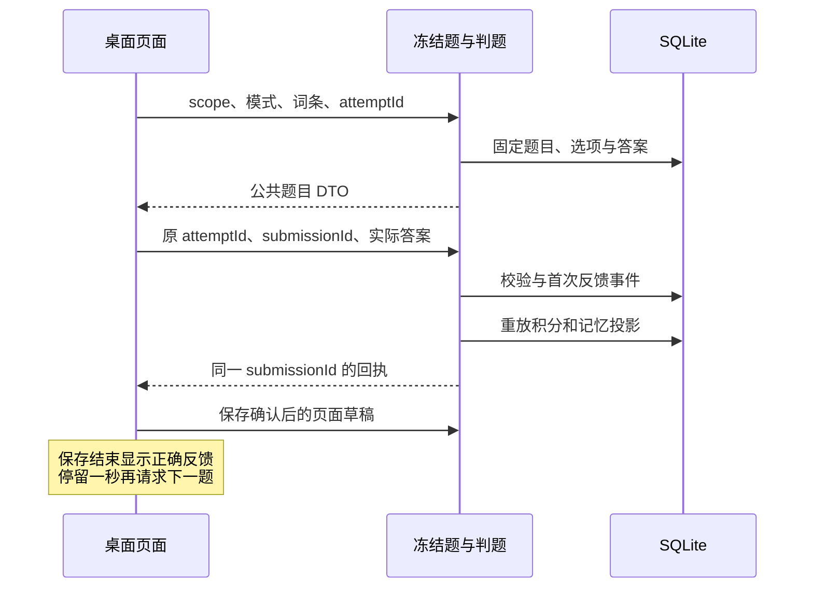
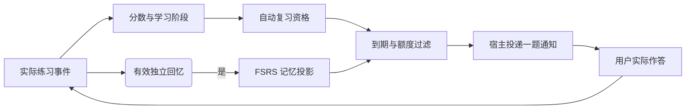

# Core 功能设计

本文说明当前功能如何处理输入并保存结果，供 Desktop、Browser 和其他连接插件复用。页面文案和通知表现属于宿主；私人身份、事件、判题、修订与回执由 Core 决定。应用允许只记录词和练习，不要求先设学习目标或计划。

## 功能入口一览

| 用户动作                   | 本机用例                              | 主要组件                                           | 持久结果                     |
| -------------------------- | ------------------------------------- | -------------------------------------------------- | ---------------------------- |
| 选择目标与安排每日额度     | 规划查询/保存                         | `DesktopPlan`、`DesktopPlanning`                   | `desktop_profile` 与规划修订 |
| 查看我的词库与筛选状态     | 词列表/详情查询                       | `DesktopWords`、`DesktopFamiliarity`               | 通常只读，不物化整本目标     |
| 手动记录、剪贴板或插件采集 | 本机 capture / LMCP `recordEncounter` | `CapturePolicy`、`LmcpReading`、`DesktopDataModel` | 个人内容、遇见、关系、回执   |
| 做一道练习                 | practice 查询/命令                    | `DesktopPracticeSessions`、`DesktopPractice`       | 冻结题与可信学习事实         |
| 继续、切模式或重开         | checkpoint 查询/保存                  | `DesktopPracticeCheckpoint`                        | 游标、每模式草稿或新 session |
| 通知快速练习               | 提醒题发行/答题                       | `DesktopReminderPractice`                          | 同一规则的练习事实           |
| 编辑笔记与多个词本归属     | 个人内容命令                          | `DesktopDataModel`、个人关系组件                   | 文本、关系与 revision        |
| 回收/恢复词                | 删除/恢复命令                         | 本机资料组件                                       | 删除标记；学习历史保留       |
| 连接、断开、撤权           | LMCP / 私有 manage                    | `LmcpService`                                      | 配对、会话、授权状态         |

完整 action 与 DTO 从 [DesktopWorkspace](../src/main/java/app/leximeet/core/DesktopWorkspace.java) 和冻结规范读取；上表是功能导航，不是新增 wire 接口。

## 1. 学习规划

规划由目标和计划组成。目标引用公共词书或整本本机词典；计划设置每日新学和复习上限，默认 10/20。用户可以取消目标或停用计划，个人遇见、笔记和学习事实仍保留。

桌面提醒的开启状态和 08:00–20:00 时间范围保存在设备规划/偏好中。题型在设置中选择，默认看词选义；约 30 分钟随机提醒的调度由 Main 执行，不让用户在规划向导里配置一长串频率参数。

保存时，通过当前规划 revision 检测并发变化。预览返回目标有效总量、首次完成新学数、剩余数量、预计完成日期，以及最多七天的日期/词列表。当前目标的今日内容取真实新学队列；未来内容按词书顺序排除已毕业和回收词。每天最多预览 50 个词，超出时明确标记已截取。累计曲线只是按每日额度完成新学的情景预测，不是熟悉程度或 FSRS 的保证；预览不物化词条、不写练习事件。学习目标改变不抹掉已学习词，也不把旧目标的成绩套到另一个词条身份。

<!-- leximeet-diagram: figure-93a1929f6a-01 -->
<picture>
  <source media="(prefers-color-scheme: dark)" srcset="diagrams/rendered/figure-93a1929f6a-01.dark.svg">
  
</picture>

查看和编辑 Mermaid 源码

[图源文件](diagrams/figure-93a1929f6a-01.mmd)

<!-- /leximeet-diagram -->

## 2. 词条身份和列表状态

公共词使用 Dictionary 的 `entry_id` 和资源 release；额外自定义词使用 UUID。显示词头、大小写归一和查询键只用于检索。某次采集材料缺少公共资源时，不能将它擅自改绑到另一条同名词。

我的词库是当前目标未回收的虚拟成员与主动采集/收藏的活动个人词的并集。没有目标时仅显示主动个人词，不把整本字典当个人词库。公共字典页仍可查到已回收词，因为回收只排除个人引用。状态、真实词性、搜索、计数和分页先在同一组查询条件下计算，不把未过滤总量当作筛选后的数量。普通读词卡不扣分；练习里的“查看答案”才是辅助事件。

| 状态   | 当前含义                                       | 例子                   |
| ------ | ---------------------------------------------- | ---------------------- |
| 未学习 | 尚无有效练习事实，初始分 10                    | 刚进入目标或新采集的词 |
| 不熟悉 | 分数为 0 的额外程度标记，可与学习中/待复习共存 | 持续答错后需要加强     |
| 学习中 | 已开始练习，尚未首次跨过 20                    | 初始 10 正确后到 11    |
| 待复习 | 已毕业且符合复习阶段/资格的词                  | 初学达到 20 后的复习   |
| 已熟悉 | 达到 30 后的保护与衰减阶段                     | 暂不进入被动自动复习   |

状态的精确定义及“阶段”与“本次到期”的区别以 [统一学习规则](统一学习规则.md) 为准。待复习标签不表示当前一定会投递通知，自动队列还检查资格、学习日、FSRS 到期和每日额度。

## 3. 六种练习怎样判分

| 模式     | 实际输入                            | 独立正确 | 错误或查看答案 | 特别边界                         |
| -------- | ----------------------------------- | -------- | -------------- | -------------------------------- |
| 单词列表 | familiar / unfamiliar / reveal 信号 | +1       | −1             | 没有答题正误选择；用户给回忆信号 |
| 看词选义 | 本题 choiceId                       | +1       | −1             | Core 核验选项属于冻结题          |
| 单词临摹 | 英文输入                            | +1       | −1             | 有答案提示，不能推迟 FSRS 到期   |
| 单词默写 | 独立英文输入                        | +2       | −1             | 中文提示隐藏目标词头             |
| 听音辨词 | 英文输入                            | +1       | −1             | 播放声音不等于完成答题           |
| 语境填空 | 真实语境的缺词输入                  | +2       | −1             | 没有合格真实例句则不可用         |

分数最低 0、最高 30。同题首次有效反馈计分一次；答错后订正、看提示后补答案和重复回执不能再加分。`correct` 的实际值由 Core 判定，`effective` 表示是否产生新的有效学习影响；正确订正可以是 `correct=true`、`effective=false`。

<!-- leximeet-diagram: figure-93a1929f6a-02 -->
<picture>
  <source media="(prefers-color-scheme: dark)" srcset="diagrams/rendered/figure-93a1929f6a-02.dark.svg">
  
</picture>

查看和编辑 Mermaid 源码

[图源文件](diagrams/figure-93a1929f6a-02.mmd)

<!-- /leximeet-diagram -->

一秒停留属于 Desktop 交互，不进入 Core 的积分规则，也不写到 LMCP 协议。正常保存时，页面显示“正在保存”；只有操作结束后回执仍未知或保存确实失败，才显示重试入口。

选择题干扰项优先从本轮冻结词序中选取真实释义，不足时再从公共词典有界采样。已生成题目持久化，因此重试和重启保留相同选项与答案；后续资料变化不改变已冻结题目的判题依据。

## 4. 保存失败、未知结果和继续

| 时刻                       | 调用方应做什么                     | 不应做什么                      |
| -------------------------- | ---------------------------------- | ------------------------------- |
| 正在发送或保存草稿         | 锁定本题输入，等待原操作           | 用 pending 标记显示保存失败红条 |
| Core 回执缺失或不匹配      | 保留原题、原答案、原 submissionId  | 猜测正确并自动换题              |
| Core 已计分，确认草稿失败  | 重试原身份，回执恢复后继续         | 新生成 ID 再加一次分            |
| 提示扣分成功，提示读取失败 | 只读取原冻结题目                   | 再发一条扣分事件                |
| 切模式、范围、重开、离页   | 保存允许保存的草稿，取消旧推进任务 | 让旧计时器影响新题              |

重开创建新的练习 session/attempt 空间，保留已经提交的事件和原始词序，不重置分数。未确认的反馈需要先恢复，不能通过“重新开始”丢弃唯一能找回操作结果的 ID。

## 5. 积分和提醒队列

首次达到 20 表示完成初学；自动复习最早次日。达到 30 后保护 72 小时，再每 48 小时衰减 1，自动衰减最低到 20，此时重新获得自动复习资格。已经处于 30 的词再次正确不会重新启动保护期；分数降到 30 以下后再次实际达到 30 才重计时。

FSRS 用有效独立回忆安排自动到期。主动提前练习允许做，但不把未到期的日程任意延后。每日新学与复习完成量按规则计算，并对同词去重，不能把临摹次数当作完成了多次独立复习。

<!-- leximeet-diagram: figure-93a1929f6a-03 -->
<picture>
  <source media="(prefers-color-scheme: dark)" srcset="diagrams/rendered/figure-93a1929f6a-03.dark.svg">
  
</picture>

查看和编辑 Mermaid 源码

[图源文件](diagrams/figure-93a1929f6a-03.mmd)

<!-- /leximeet-diagram -->

## 6. 三入口采集和安全

剪贴板只匹配当前学习目标；无目标或无匹配不通知。插件和手动记录允许增加目标外词。三种入口共用安全政策：匹配词所在单句、敏感内容替换 `xxx`、UTF-16 有界长度、保留真实目标位置、默认滚动七天同词同句去重。

重复键对安全句子做 NFC、空白归一和大小写折叠，但展示保留安全原句。`The Node uses a system.` 和同句大小写变化可命中同一遇见；`Node starts another process.` 仍是另一句。只共用一个单词不构成语境重复。

采集事务同时处理词条个人内容、遇见、词本关系、revision 和回执。重复不新增遇见，也不以空笔记覆盖旧笔记；不悄悄恢复回收词。完成脱敏后，不会将未脱敏原文另存到数据库或回执里。

本机剪贴板的 operationId 和 LMCP eventId 属于不同调用命名空间。两者都允许原参数、原 ID 恢复同一结果；同 ID 换参数应拒绝。详见 [采集安全与重复语境](采集安全与重复语境.md)。

## 7. 个人内容、回收和备份

当前桌面编辑入口只有「我的笔记」和多选单词本，保存携带 `expectedRevision`，冲突返回后保留用户草稿。个人编辑命令明确拒绝自定义标签和释义覆盖，不保留旧入口转发。正式领域 DTO 不保存个人释义或用户标签；LMCP 词卡个人内容及采集批注只保留 `note`，旧字段即使为空也拒绝。公共释义、词性和词形仍来自 Dictionary。删除一个普通词本会更新受影响词的修订，旧表单不能把已删除关系写回来；系统词本受到保护。

回收站使用删除标记保留历史，恢复是明确动作。未物化的目标词也可以回收：Core 只建立个人墓碑，排除词库、任务和本机新一轮练习，保留公共 Dictionary；恢复目标引用不会把它误当主动采集词。每次最多 100 词的批量回收、恢复和多词本追加都在同一事务内校验，任一身份/归属无效整笔回滚。重复追加已有的单词本归属保持幂等。词库成员变动重建本机冻结队列，原题和答题历史保留；已回收词的旧冻结题不能继续记分。资料备份覆盖私人实体、关系、事件、投影和当前格式所需元数据，公共词典资源单独安装。当前版本只支持同 schema 100 格式，不承诺未发布测试数据库的升级转换。

## 8. 插件连接与界限

连接功能有两层：Main/Host 负责可信传输与真实确认窗口，Core 负责 owner、会话、权限、阅读与采集事务。断开会结束当前会话，插件恢复自己的独立 A；已写到桌面的内容仍留在 B。撤权会持久撤销授权，比断开更严格，也不同于短暂离线。

1.0.0 没有插件远程练习、独立 A 导入 B、账号登录或云同步。不能把“可连接”“已授权”“可读取私人资料”当成同一个状态。接口与验收入口见 [1.0.0 核心职责](1.0.0核心职责.md) 和 [发布与验收](发布与验收.md)。
