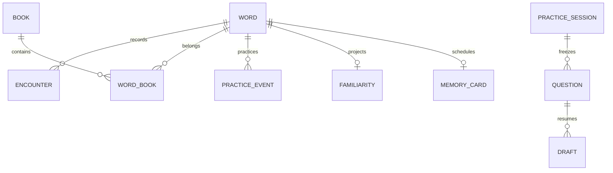

# 数据模型与备份

## 公共资源与个人资料

Dictionary 0.0.3 是只读词典；Core 按需查询索引，不为整本目标复制十万条私人词。个人笔记、遇见、词本关系和学习事件独立保存。公共资源缺失时保留私人身份与历史，返回资源不可用，不能改绑同词头的另一条词。

公共词身份使用 Dictionary `entry_id`，wire 为 `WordRef {kind:"dictionary",entryId,release,entrySchema:"leximeet.entry.v2"}`；自定义词使用 UUID `customId` 与 language。`headword`/normalized 供显示和搜索，不是跨端主键。更新词典版本不会擅自改写已保存事件的来源版本。

<!-- leximeet-diagram: figure-b2f3651da3-01 -->
<picture>
  <source media="(prefers-color-scheme: dark)" srcset="diagrams/rendered/figure-b2f3651da3-01.dark.svg">
  
</picture>

<details>
<summary>查看和编辑 Mermaid 源码</summary>

[图源文件](diagrams/figure-b2f3651da3-01.mmd)



</details>
<!-- /leximeet-diagram -->

图中展示的是业务关系，各端无需复制相同的物理表。Browser 的 IndexedDB 与 Core 的 SQLite 可以不同，但稳定身份、字段含义和重放规则须一致。

## 主要表组

| 表组                                                 | 保存内容                                                          |
| ---------------------------------------------------- | ----------------------------------------------------------------- |
| `words/word_details/desktop_word_identity`           | 个人词聚合、补充内容、公共或自定义身份                            |
| `books/word_books`                    | 多词本归属；`words.book_id` 是主归属，不抹掉其他关系        |
| `encounters/encounter_details`                       | 安全句子、UTF-16 位置、来源与撤销；保存文本不另留未脱敏原文       |
| `desktop_profile`                                    | 可选目标、双额度、固定学习时区、提醒开关与时间范围、计划修订      |
| `desktop_practice_facts/desktop_entities`            | 原始练习/撤销事件和 stable identity；事件保留，不直接相加最终分数 |
| `desktop_familiarity/desktop_cards/desktop_reviews`  | 可重建的分数/阶段与 FSRS 投影、实际调度证据                       |
| `desktop_practice_sessions/items/questions/*drafts`  | 固定题目、原答案、位置、模式草稿和断点                            |
| `lmcp_meta/pairings/sessions/operations/host_grants` | 设备身份、授权、会话和操作回执                                    |
| `lmcp_capture_events`                                | 插件遇见幂等与 Main 私有剪贴板回执命名空间                        |

个人编辑只保存笔记和多词本归属，携带 `expectedRevision`；笔记、关系和 revision 在同一事务保存，陈旧草稿返回 409。删除普通词本记录墓碑并推进关联词修订，避免旧草稿复活已删除关系。当前结构不创建用户标签表，WordData 只保存词标识、笔记、主动收录及多词本归属，不输出个人释义或标签占位。`words.meaning` 是只读公共词典摘要缓存，未知词默认空字符串，手动和插件采集不能写入释义。词形语法信息仍来自只读 Dictionary。学习来源、规则版本、设备序号和逻辑时钟都是事件证据，不由客户端随意改写。

## 事务与容量

每个资料目录持有 `core.lock`，Core 串行使用连接，SQLite 开启 foreign_keys、WAL 和 synchronous=FULL。采集、事件、投影、修订和回执原子提交；失败整笔回滚。结果未知时，保留原稳定 ID 查询或重试，不能换编号重复写入。

当前主动采集/收藏的活动个人词上限为 10,000 词，公共目标的虚拟词和纯目标墓碑不因被查询或回收计入此上限。`desktop_word_links.manual_active` 是主动归属来源，回收/恢复保留它；`words.deleted_at` 决定当前是否活动。普通 HTTP 正文最多 2 MiB，JSON 备份独立上限 64 MiB，文件备份最多 2 GiB；LMCP 单帧仍由冻结契约限制为 256 KiB。各层预算不可互换。

## 当前格式备份

两种载体使用同一份完整 SQLite 快照，包括个人词、笔记、遇见、多词本关系、学习规划、练习事件、FSRS、冻结题与各模式断点。它们不会只备份页面 snapshot，因而不会漏掉后台事实。

| 入口 | 载体与上限 | 用途 |
| --- | --- | --- |
| `GET /api/export-archive` / `POST /api/restore-archive` | SQLite 文件，最多 2 GiB | Desktop 默认文件备份 |
| `GET /api/export` / `POST /api/import` | JSON 包装的 Base64 SQLite，整个正文最多 64 MiB | 小容量、需要 JSON 的本机宿主 |

JSON envelope 必须与下例一致；`data` 是完整文件编码，示例中的省略号不可作为备份内容：

```json
{
  "format": "leximeet-backup",
  "version": 100,
  "schemaVersion": 100,
  "encoding": "sqlite-base64",
  "exportedAt": "2026-10-04T00:00:00Z",
  "data": "<标准 Base64 SQLite 文件>"
}
```

Base64 体积约为原文件的 4/3。Core 在编码前核对体积，超过预算请使用文件入口。普通业务 JSON 的字符串/正文限制保持不变，只有明确的备份入口允许较大的 Base64 字段。未知版本、旧 version=6 行格式、异常编码和坏 SQLite 都直接拒绝。

导出先生成一致副本，再从副本剥离配对、session、host grant、邀请秘密和设备许可，原库不改变。导入是用户确认后的**完整替换**，不与现存词逐行合并：先检查头、schema、全部表/索引/触发器、完整性、外键、领域上限与 FSRS 证据，再去授权并以一个事务恢复。失败时不会部分覆盖；成功更换资料世代、撤销原连接、重置设备许可，宿主需重新读取状态并由用户重新连接插件。

备份属于隐私资料，不应提交 Git、上传 Issue 或作为公开夹具。不得直接复制正在写入的 `leximeet.sqlite` 当作可靠备份；WAL 状态需要受控一致快照。

## 首次正式版的结构边界

本版只接受当前同构 schema 100。空目录直接初始化；0.x、无版本既有文件，以及版本号相同但含有旧实验表/字段的资料，都会被拒绝打开，并保留原文件。不会自动转换、迁移或清空。初始化与既有结构核验使用同一套定义，不能只凭 `user_version=100` 判断兼容。

首次正式发布之后如需演进，必须先设计一致快照、回滚和升级验收的兼容方案。已退休的 `plans/plan_lists/tasks/reviews/proficiency_events` 实验表不会进入新资料；当前学习状态只来自 `desktop_profile`、练习事件与正式投影。

## 首次正式结构与后续升级

1.0.0 建库与重开使用同一份完整结构定义，除 `user_version=100` 外还核对表、索引与触发器。此前同为 100、仍支持个人释义覆盖的试验结构被拒绝，拒绝前不启用写入或删除原文件。结构拒绝测试同时核对原文件 SHA-256 和原笔记，备份测试则验证当前格式重新打开与恢复。

正式 1.x 的结构变更须另外设计迁移、备份和恢复验收，不沿用初发对未发布试验库的拒绝规则代替正式用户升级。
