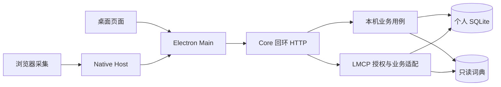
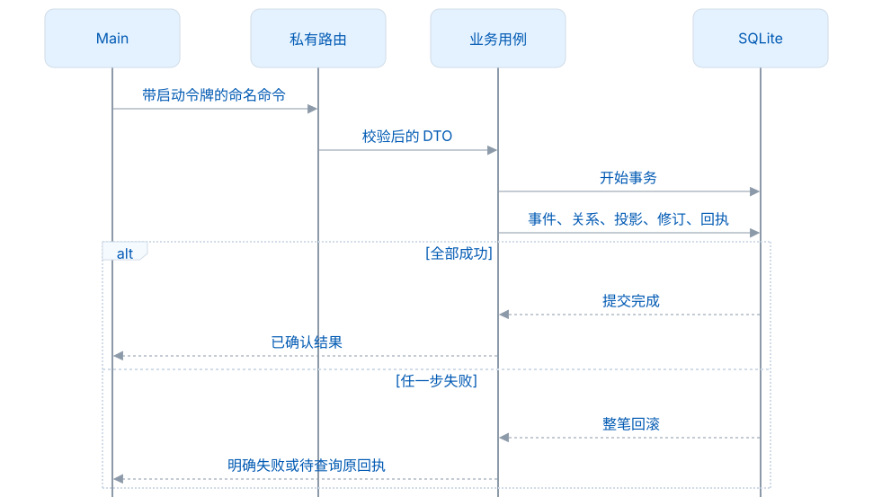
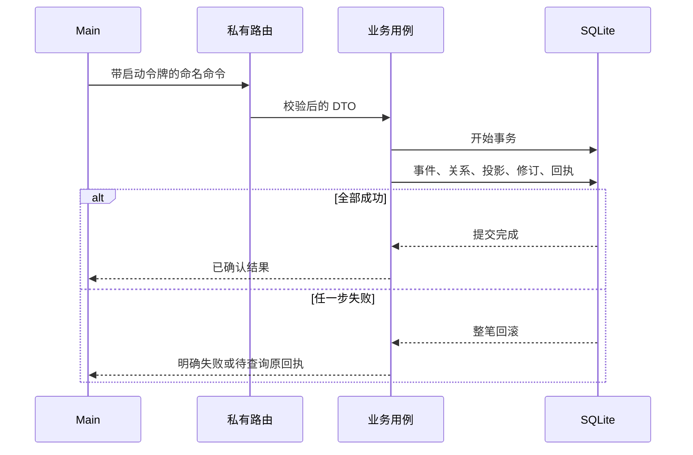
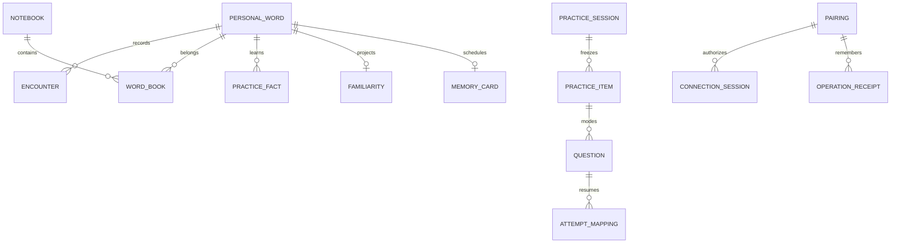

# Core 架构设计

本文面向需要修改 Core 或接入桌面端的开发者，以当前 1.0.0 源码为准。以一个具体场景为例：用户在桌面练习一个词，然后在浏览器采集它的另一句语境。两项操作都写入同一个个人资料库，分数仍只来自练习，采集不会加分。

## 进程与责任

Core 是独立的 Java 21 进程，由 Electron Main 启动。Spring Boot 用来装配服务和打包运行依赖；程序没有启动 Spring MVC 服务栈，HTTP 路由由本仓服务实现。个人 SQLite 统一由 Core 写入，公共 Dictionary 通过只读挂载参与查询。

<!-- leximeet-diagram: figure-75a9c50a16-01 -->
<picture>
  <source media="(prefers-color-scheme: dark)" srcset="diagrams/rendered/figure-75a9c50a16-01.dark.svg">
  
</picture>

查看和编辑 Mermaid 源码

[图源文件](diagrams/figure-75a9c50a16-01.mmd)

<!-- /leximeet-diagram -->

Main 持有启动令牌，Renderer 不接触令牌、SQL 或任意文件操作。Browser 使用 LMCP 会话授权，其凭据与 Main 的私有 HTTP 令牌不同。Core 不接管窗口、剪贴板和系统通知；这些能力由 Main 实现。

| 代码入口                                                              | 实际职责                                            | 依赖方向                     |
| --------------------------------------------------------------------- | --------------------------------------------------- | ---------------------------- |
| `Main`、`CoreApplication`、`CoreOptions`、`CoreConfiguration`         | 解析启动参数、资料目录、时钟，创建服务并处理关闭    | 启动入口 → 服务              |
| `CoreServer`、`LmcpRoutes`                                            | 校验 HTTP/方法输入，分发私有用例和规范方法          | 路由 → 用例，不写学习分数    |
| `LeximeetService`、`Database`                                         | 持有私人数据库、事务、通用资料与服务生命周期        | 用例 → 同一个事务边界        |
| `DesktopWorkspace`                                                    | 桌面状态、查询、命令总入口                          | 委派各业务组件               |
| `DesktopDataModel`                                                    | 个人实体、WordRef、修订、事件及 LMCP DTO 之间的适配 | 连接数据与本机业务           |
| `PublicLexicon`、`DesktopWords`、`DesktopLibraryOperations`                                       | 公共资源挂载、虚拟目标词、个人覆盖与详情            | 读取词典和私人关联           |
| `DesktopPlan`、`DesktopPracticeSessions`、`DesktopPracticeCheckpoint` | 可选规划、冻结题、断点和本机题目适配                | 调用词条和可信反馈用例       |
| `DesktopPractice`、`DesktopLearningReplay`、`LearningPolicy`          | 判题、记录学习事件、重建分数与阶段                  | 写事件，再更新投影           |
| `DesktopReviews`、`FsrsSchedulingService`                             | 有效独立回忆与 FSRS 排期                            | 使用记忆模型，不决定 UI 标签 |
| `CapturePolicy`、`LmcpReading`                                        | 安全语境、重复检查和连接采集事务                    | 共享个人资料身份与事务       |
| `LmcpService`、`LmcpContract`、`LmcpSchema`                           | 来源、协商、授权、回执及固定规范校验                | 在授权边界内委派业务         |

具体类名以 [源码目录](../src/main/java/app/leximeet/core/) 为准。这里描述现有职责，不要求把每个类改成独立服务。本机 `/api/desktop/*` 对应当前页面用例；插件使用冻结 LMCP。基础 snapshot 只读取个人资料、语境、词本与设置，不携带另一套学习模型或标签管理。旧基础 CRUD 已退休，正式个人编辑、收藏/采集、回收与词本管理统一进入 `DesktopWorkspace.command`；`WordRelationsService` 只校验并替换词本关系。

## 一个资料目录，一个写入者

`Database` 在个人资料目录持有锁，数据库使用 WAL、外键和 `synchronous=FULL`。事务在同一连接上串行执行。公共词典使用独立只读资源，不作为同步来的个人数据库。

<!-- leximeet-diagram: figure-75a9c50a16-02 -->
<picture>
  <source media="(prefers-color-scheme: dark)" srcset="diagrams/rendered/figure-75a9c50a16-02.dark.svg">
  
</picture>

查看和编辑 Mermaid 源码

[图源文件](diagrams/figure-75a9c50a16-02.mmd)

<!-- /leximeet-diagram -->

因此“成功响应”应代表事务已提交。响应丢失不等于事务失败；调用方须保留原 `submissionId`、`eventId` 或 `mutationId` 查询/重试。用新 ID 重发会失去识别同一次操作的依据。

## 数据不是一张单词表

一个公共词可以出现在学习目标里，却尚未产生个人行。发生采集、写笔记或学习操作时，Core 才按需保存个人内容与稳定引用。

| 表组                                                                              | 真正保存的内容                             | 可否作为学习真源                 |
| --------------------------------------------------------------------------------- | ------------------------------------------ | -------------------------------- |
| `words`、`word_details`、`desktop_word_identity`、`desktop_word_links`            | 私人词及公共/自定义身份、覆盖内容          | 身份和个人内容的真源             |
| `encounters`、`encounter_details`                                                 | 安全语境、来源、位置与遇见时间             | 遇见真源；本身不加分             |
| `books`、`word_books`                                        | 多词本归属关系                             | 关系真源                         |
| `desktop_profile`                                                                 | 目标、计划额度、提醒范围、学习时区         | 规划真源                         |
| `desktop_practice_facts`、`desktop_entities`                                      | 原始练习事实、撤销事件、设备序号、规则版本 | 学习重放的真源                   |
| `desktop_familiarity`、`desktop_cards`、`desktop_reviews`                         | 分数/阶段、记忆卡与有效调度证据            | 按规则维护的投影，不直接编辑分数 |
| `desktop_practice_sessions`、`desktop_practice_items`、`desktop_questions`        | 冻结词序、题目、选项、私有答案             | 当前题判题依据                   |
| `desktop_attempt_questions`、`desktop_practice_drafts`、`desktop_question_drafts` | attempt 映射、每模式输入与断点             | 恢复依据；不能自报正误           |
| `lmcp_pairings`、`lmcp_sessions`、`lmcp_operations`、`lmcp_host_grants`           | 配对、短会话、幂等回执、Host 授权          | 连接授权真源                     |

完整字段见 [DesktopSchema](../src/main/java/app/leximeet/core/DesktopSchema.java)、[LmcpSchema](../src/main/java/app/leximeet/core/LmcpSchema.java) 和 [数据模型与备份](数据模型与备份.md)。个人结构是 schema 100；Dictionary 0.0.3 和公共索引版本是另外两个版本，不要互相代替。

<!-- leximeet-diagram: figure-75a9c50a16-03 -->
<picture>
  <source media="(prefers-color-scheme: dark)" srcset="diagrams/rendered/figure-75a9c50a16-03.dark.svg">
  
</picture>

查看和编辑 Mermaid 源码

[图源文件](diagrams/figure-75a9c50a16-03.mmd)

<!-- /leximeet-diagram -->

图中的 `PERSONAL_WORD` 等是业务名称，实际物理表以上表为准。Browser 的 IndexedDB 不需要复制 SQLite 的 DDL；需要统一的是 WordRef、字段含义、关系、事件和规则版本。

## 冻结题与页面草稿分开

`DesktopPracticeSessions` 为一个 session 的位置和模式生成题目，保存题干、选项和私有正确答案。之后同题重试、提示读取和应用重启都读取已经保存的题目，不重新抽选项。

`DesktopPracticeCheckpoint` 为本机 scope 保存一份冻结词序，按 `localModes` 惰性建立各模式独立 session，`localQueueId` 引用同一词序，不为大型词书复制六份队列。六种模式分别持有游标、题目、输入和完成断点；切换模式及重启不会覆盖彼此。重新开始重新读取当前模式的范围，新采集或词本变动会进入新词序；相同 ID 顺序复用原队列。其他模式仍保留原词序、断点和学习事件；`localLastMode` 只记录页面恢复时最后选中的模式，不参与判分。恢复时 `answered` 从已提交事实推导，`assisted` 从冻结题读取；页面传来的这两个字段不会成为判分依据。

目标词书与整本词典的首次冻结共用 `freezeDictionaryQueue`，在同一 SQLite 事务内用 `INSERT … SELECT` 写入词序。位置由词书成员顺序或词典全局顺序生成，个人关联仍优先使用同一词条的最小个人 ID，回收墓碑仍排除成员。每轮最多 100 万词；公共引用只保存身份与发布版本，六种模式继续复用同一队列。这个路径不再为每个词重新创建 SQL、查询关联和拷贝元数据，也不通过延长页面超时掩盖冷启动耗时。

看词选义候选优先来自本轮冻结范围，最多读取 80 个候选 ID 并按题目种子打乱。不足时读取公共词典一个有界位置窗口，必要时从开头补齐，候选总量最多 80；候选只读，不物化成私人词。选项仍使用真实中文释义，至少两项且没有重复释义；不满足这些条件时明确返回不可用。

这解决了“每题都重复词典开头三个干扰项”的问题，但不会改变已发题或提高同题可得分次数。题目种子让同次发题稳定；长期恢复时的稳定性由已保存的题目保证，不依赖重启时再次运行随机算法。

## 分数、阶段与 FSRS

`LearningPolicy` 和 `DesktopLearningReplay` 从有效事件计算 0–30 分、阶段、毕业和满分保护时间。`FsrsSchedulingService` 的 FSRS 状态用于自动复习排序。两者通过有效独立回忆事件衔接，而非用一个字段同时表示“分数”和“复习到期”。

例如：临摹正确可加 1，但不冒充独立回忆来推迟自动到期；系统通知只是送出一道题，显示、忽略、关闭通知不产生练习事件。详细规则见 [统一学习规则](统一学习规则.md) 与 [FSRS 档案与重放](FSRS档案与重放.md)。

## 时间与读投影

业务 Clock 用于计算学习日、保护期、积分衰减和去重窗口。认证和网络超时使用真实时间，不能随着测试业务时间前进而改变配对有效期。测试仅在隔离资料内通过专属时钟文件推进业务时间，不修改电脑时间。

同一个查询中的状态、数量与分页使用相同的观察时间。30 分词的衰减可以在读取投影时计算，不为每次列表读取写入新的练习事件或推进 revision。规则变化属于未来正式版本的升级设计，不能临时改数据库投影绕过事件重放。

## LMCP 与未来同步

1.0.0 本地连接让插件封存独立资料 A，读写桌面资料 B。Core 只向已授权 owner 提供规范阅读和采集接口，没有向插件开放整个桌面学习 API。正式 1.x 运行时按 API 主版本、最低 API 和必需能力协商；构建仍校验随包 17 项规范原字节。

2.0.0 云同步尚未实现。未来需要独立设备的事件交换与冲突设计，不能把现有列表 DTO 当作完整同步格式，也不能用归一词头代替公共 `entry_id` 或自定义 UUID。

开发与验证入口见 [开发与测试](开发与测试.md)，接口边界见 [1.0.0 核心职责](1.0.0核心职责.md)。
