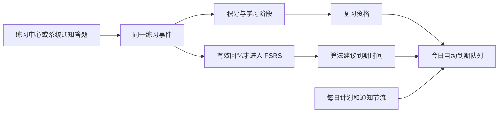

# 统一学习规则 v2

规则标识：`leximeet.learning/2`。本文件是 Desktop Core 的业务约定，也供 Browser 独立运行与 LMCP 接入实现参考。数据库 schema 100 与学习规则版本分别管理。仅接受符合此版固定规则的事件，不转换预发布旧库。

## 1. 四个职责

<!-- leximeet-diagram: figure-931af725f7-01 -->
<picture>
  <source media="(prefers-color-scheme: dark)" srcset="diagrams/rendered/figure-931af725f7-01.dark.svg">
  
</picture>

<details>
<summary>查看和编辑 Mermaid 源码</summary>

[图源文件](diagrams/figure-931af725f7-01.mmd)



</details>
<!-- /leximeet-diagram -->

积分描述用户可见的进度；学习阶段保留学习经历；FSRS 计算回忆时机；提醒频率控制打扰程度。主动练习可以随时进行，不受自动复习日期限制。

## 2. 一次练习如何计分

| 模式                      | 首次独立正确 / 熟练 | 首次错误 / 不熟悉 / 查看答案 |
| ------------------------- | ------------------: | ---------------------------: |
| 单词列表 `word-list`      |                  +1 |                           −1 |
| 看词选义 `meaning-choice` |                  +1 |                           −1 |
| 临摹 `copy`               |                  +1 |                           −1 |
| 默写 `recall`             |                  +2 |                           −1 |
| 听音辨词 `listening`      |                  +1 |                           −1 |
| 语境填空 `cloze`          |                  +2 |                           −1 |

初始分数为 10，最低 0，最高 30。没有每天最多加 4 分的限制。同一个 `attemptId` 只采用首次有效反馈；订正和重复提交不补发积分；辅助成功为 0 分。采集、读词卡、播放发音、显示/忽略通知不计分。练习中心查看遮挡答案才扣分，普通阅读不会扣分。

Core 校验答案和选项，不接受前端直接提交 `correct` 或目标分数。自动拼写完成计一次答案，单次键入错误不逐字扣分。列表自评有积分，但不混入客观选择题正确率。

看词选义的提示与正确选项使用同一份冻结综合释义，使用只读公共词头的综合摘要，长度最多 200 UTF-16；不能直接把第一个义项当成常用意思。state、behavior 等多义词保留综合含义。没有真实释义、不同选项或有效例句时返回明确的不可用题，展示当前目标词及原因；不沿用上一词卡，也不产生计分题。存储、身份等异常仍真实失败，不伪装为词条不可用。

同一题订正只更新实际反馈，不补发首次积分。重开恢复时，显示最新已确认的反馈；草稿按会话、词位置和模式隔离。开始新一轮只创建新的题目/草稿空间，已经保存的遇见、笔记和成绩保留。

## 3. 分数之外还要保存经历

| 状态               | 条件                          | 示例                                                            |
| ------------------ | ----------------------------- | --------------------------------------------------------------- |
| 未学习 `new`       | 尚无 v2 有效练习              | 初始 10 分表示尚未知晓掌握程度                                  |
| 待学习（安排标记） | 未学习且被当前今日队列选中    | 属于 `new`，额外 `scheduled=true`；不会永久写死为另一种记忆状态 |
| 学习中 `learning`  | 已开始，尚未首次跨越 20       | 练习后可能为 0–19                                               |
| 待复习 `review`    | 曾跨越 20，目前不在满分休息期 | 复习过程中降到 10 或 0 仍保留初学完成经历                       |
| 已熟悉 `mastered`  | 曾达到 30，当前休息周期未结束 | 自然衰减至 29–21 仍处于休息期                                   |

0 分时另有不熟悉标记；1–9 表示需要巩固。不熟悉是熟悉程度条件，可以和学习中/待复习共存。

首次 19 +2 =21 也算完成初学。`graduatedAt` 和 `graduatedDay` 只记录一次。20→19→20 不再占新学名额，不重置明日资格。`words.status` 是本机列表投影；跨端消费者读取 `familiarity` 和 `learningStatus`。

## 4. 满分休息和衰减

只有实际从不足 30 跨到 30 时创建 `masteryCycleAt`。先保护完整 72 小时，再每经过完整 48 小时扣 1：第 5 天 29，第 7 天 28，第 23 天 20。衰减最多到 20；主动错误可降到 0。

- 30→30 不重置；25→26 不重置；先衰减至 29，再练对 +1 则重新计时。
- 先补算到练习发生时刻，再应用练习分数。关机时间照常计入，读取不生成虚构的答错事件。
- 按周期已扣次数补算新增衰减，不重复扣整段历史。
- 主动错误使休息中的词降到 ≤20，也释放复习资格；29 分错一次不是立即结束休息。
- 撤销使其满分的事件后，重建整个周期。不能只改分数，留下过期保护计时。

## 5. 复习池、FSRS 与每日数量

首次完成初学：`reviewEligibleAt` 为工作区学习时区的下一个自然日零点。休息结束：资格为实际降至 20 的时刻，不再等待一个学习日。

`fsrsDueAt` 只保存算法输出。有资格且已到该时间才进入自动到期队列。没有任何独立回忆（例如纯临摹升至 20）时，使用 `firstRecallDueAt` 作为首次回忆验证，不虚构 S/D。

```text
automaticDueAt = max(reviewEligibleAt, fsrsDueAt ?? firstRecallDueAt)
候选 = 阶段为 review && 当前时间 >= automaticDueAt
```

有效回忆映射：独立成功和列表熟练为 good；独立失败/列表不熟悉为 again；临摹、揭示、辅助订正不推进 FSRS。已有记忆未到期时，提前成功可以增加积分；复习资格已生效的首次独立成功也计入每日完成量，但不延长 FSRS。真实失败仍可以拉回短期巩固。调度固定 `fsrs-6/java-fsrs-1.0.0`，保留现有 FSRS-6 参数、保持率 0.9 和关闭随机模糊；不改变算法权重。

新建计划默认每日新学 10 / 复习 20。每日新学完成按当天首次跨越 20 的不同词计数；每日复习完成按复习资格已生效、独立成功的不同词计数。同日首次毕业不重复占旧词复习名额。优先延续进行中的初学，更换目标时也保留；确认遇见延续既有优先队列。自由练习可超出额度。失败不算完成；同日已成功的词后来失败，仍可进入短期巩固，不二次增加完成数。

临摹得分可以完成初学，但不能完成有效回忆复习。关闭提醒只停通知；暂停计划停止补充目标新词，保留目标、历史和进行中的学习。

## 6. 事件和投影字段

| 数据     | 字段 / 责任                                                                                                                                                                                                      |
| -------- | ---------------------------------------------------------------------------------------------------------------------------------------------------------------------------------------------------------------- |
| 词条身份 | 公共词用 Dictionary `entry_id`，个人词保留个人 ID 与公共关联；不靠大小写归一的显示文本合并                                                                                                                       |
| 练习事件 | `id/submission_id`、`attempt_id`、`word_id`、`mode`、`signal`、`correct`、`assisted`、`created_at`、`study_day`、`zone`、`rule_version`、`device_id/device_seq/logical_clock`、`evidence`、`origin`、`undone_at` |
| 来源     | `origin=practice/notification`，不会改变分值                                                                                                                                                                     |
| 阶段投影 | `score/status/startedAt/graduatedAt/graduatedDay/reviewEligibleAt/firstRecallDueAt/masteryCycleAt/nextDecayAt/asOf`                                                                                              |
| 查询索引 | `desktop_familiarity`；分数、阶段、资格、衰减边界，可从事件重建                                                                                                                                                  |
| 调度事实 | `desktop_reviews` 的前后记忆状态、算法标识、回合和真实时间；`desktop_cards` 是调度投影                                                                                                                           |
| 通知题目 | `desktop_questions` 保存统一冻结题与私有答案；`desktop_reminder_questions` 仅保存通知投递与有效期                                                                                                                |

事件按 `(logical_clock,device_id,device_seq,id)` 稳定排序；投影需显式 `asOf`，用相同输入和时刻比较跨端结果。设备时钟回退时不能把投影缓存误当最终真相。本机新练习不允许早于该词上次事件；时钟回退可以查询，不能追加倒序反馈。归并事件后重算，不能直接相加最终分数。

`review_completed` 的实时写入与事件重放使用同一口径：复习资格已生效、非毕业当天、非熟悉休息期，且该题首次反馈为无辅助的独立成功。它不要求 FSRS 已到期；每日完成数量再按不同词去重。例如明天已经可以复习，但 FSRS 建议三天后再提醒：明天主动答对计完成 1，该词仍不进入自动队列，FSRS 日期保持不变。

后续同步端需要按统一事件顺序重算完成标记，不能将两个端的完成数量相加。LMCP 连接直接读取桌面状态，不导入或合并插件学习事件；云端冲突处理属于 2.0.0。

## 7. Core 用例接口

Renderer 经 preload/Main 调用本机 Core，以下列出本机适配入口。对外使用随包冻结的 LMCP reading API，协议不暴露练习或规划命令。

| 命令/查询                   | 要求与返回                                                                                                                                    |
| --------------------------- | --------------------------------------------------------------------------------------------------------------------------------------------- |
| `practiceRecord`            | 词 ID、模式、稳定 submissionId/attemptId、答案或信号；同提交内容变化为冲突；失败事务不留半事件                                                |
| `undoPractice`              | submissionId；只允许撤销该词最新未撤销练习，积分/周期/相关 FSRS 一起回退                                                                      |
| `savePlanning` / `savePlan` | revision 并发检查；目标、每日额度、提醒开关与时间范围原子保存；可选 `reminderModes`，未提供时保留当前值；`reminderInterval` 仅接受固定基准 30 |
| `saveReminderPreferences`   | 设置页独立保存非空、不重复的 `reminderModes` 与 `expectedRevision`；只修改模式和 revision，不启用计划、不改变目标、额度、开始日或学习历史     |
| `issueReminderQuestion`     | Main 提供 `supportedModes`；在用户选择中轮换可出题模式；返回固定题目或 `unavailable` 原因                                                     |
| `answerReminderQuestion`    | questionId 与答案/choiceId/signal；30 分钟内可答；相同回答重试返回 duplicate，不重复计分                                                      |
| `reminderQuestions` 查询    | 用于恢复通知中心仍存在的未回答题目；不会重新投递全部历史                                                                                      |
| 词库 `learningStatus`       | all/new/learning/review/mastered/unfamiliar；先筛选整库再计数分页                                                                             |

练习页和通知统一使用冻结题目、首次有效反馈与撤销事件。通知的词头、释义、选项和语境直接取同一冻结 DTO，支持 Dictionary v2 的 sentence 例句；没有题目时只跳过 EXERCISE_UNAVAILABLE，存储及其他异常不能隐藏。`practiceRecord` 返回 Core 计算的 `practiceFeedback`；选项使用不携带正确性标记的随机 choiceId。

提醒是设备能力：Main 在有效时间窗口内均匀抽取 25–35 分钟间隔，平均 30 分钟，不再设置每日 3 次上限。学习规划保存开关和范围，设置页选择通知模式并显示只读频率。`reminderInterval=30` 是策略基准，不代表每次固定 30 分钟，也不改变 `leximeet.learning/2` 或 FSRS 参数。下次提醒时刻只在本机持久化，不是跨端学习事件。

## 8. 工作区初始化与连接

schema 100 只接受全新资料空间或当前同结构文件。0.x / rc 测试库及同版本不同结构拒绝打开，不迁移、不转换历史分数，不保留旧解释器；原文件不删除。正式发布后的兼容需要独立方案。

Browser 连接时封存独立资料 A，使用桌面 B；不上传练习、草稿、FSRS 或计划。断开后恢复 A，独立账号仍保持退出状态。连接模式直接使用 getWord 的只读学习摘要，不自行计算第二份桌面权威状态。

桌面内部保存原始事件，按 `(logicalClock,origin.deviceId,deviceSeq,entityId)` 全序重放，十进制串按数值比较。同序号或事件 ID 不能对应不同内容；同 attemptId 不能更换词条/模式。撤销后分数、阶段和 FSRS 一起重建；不能只回退一个缓存字段。此内部资料结构为后续 LMSP 保留，但本版没有跨设备事件导入或云同步入口。

### `historyHash` 的固定输入

`SHA-256(JCS({mergeProfile,algorithmProfile,initialDueAt,asOf,practice,retractions}))`。`asOf` 是规范毫秒 UTC；practice 是截至该时刻、未被有效撤销、按上述全序排列的 `{entityId,data}`；不包含与计分无关的 mutable revision；retractions 是截至该时刻的 `{entityId,data}` 数组并按 entityId 排列。mergeProfile/algorithmProfile 使用随包完整 JSON，而非仅版本号。initialDueAt 使用截至该时刻所有原始练习事件的最早基线，包含被撤销事件；没有事件时为 null。原始被撤销事件保留在资料库，hash 的 practice 仅保留有效项。相同资料水位、评估时刻和冻结契约才能比较结果。

## 9. 复用与验证

[规则向量](../src/test/resources/learning-rule-v2-vectors.json)包含固定事件、计算时刻和分数/阶段/关键时间期望；[纯规则与 SQLite 测试](../src/test/java/app/leximeet/core/LearningV2Test.java)执行向量和跨日闭环。[本机冻结练习测试](../src/test/java/app/leximeet/core/DesktopPracticeCheckpointTest.java)覆盖继续、重启、换模式和新一轮；[LMCP 实际事务测试](../src/test/java/app/leximeet/core/LmcpServiceTest.java)覆盖配对、会话、幂等、撤权和导航确认；[只读与采集测试](../src/test/java/app/leximeet/core/LmcpReadingTest.java)覆盖公共资源、身份、词本和容量。

Browser 独立模式应通过相同积分向量，再对齐 FSRS 数值与学习步骤；连接模式直接使用桌面回执。1.0.0 验证配对、回执、读取租约、来源权限和 Provider 切换；2.0.0 再验证跨设备合并、LMSP 与云同步。Core Java 通过不等于所有客户端和平台已经验收。

[提醒偏好测试](../src/test/java/app/leximeet/core/DesktopReminderPreferencesTest.java)覆盖独立保存、非法模式回滚、版本冲突、重启和当前文件备份恢复；学习历史与 FSRS 不随通知频率变化。
