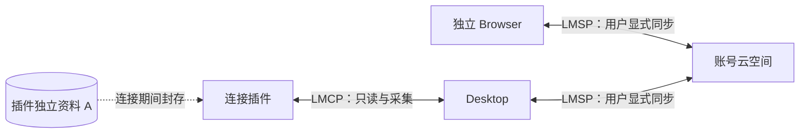

# 路线与任务

## 1.0.0 本机交付

| 工作                                           | 状态                          | 验证依据                                                 |
| ---------------------------------------------- | ----------------------------- | -------------------------------------------------------- |
| 新 schema 100、只读 Dictionary 与个人资料分离  | 已实现                        | 初始化/资源/容量/备份回归                                |
| 学习规划、六模式冻结判题、v2 状态与 FSRS       | 已实现                        | 统一向量、七日、撤销、冻结/重启测试                      |
| 独立模式断点、目标词回收、原子批量、词性筛选与具体规划预测 | Core 已实现；宿主验收另记录 | `DesktopPracticeCheckpointTest`、`DesktopLibraryManagementTest`、`DesktopPlanningTest` |
| 默认七天查重、脱敏与单句窗口                   | 已实现                        | 共享采集向量、三入口真实 SQLite 隐私与事务检查           |
| LMCP 本地连接、权威 B、回执与断开/撤权         | 已实现                        | Java 契约与权限回归；宿主真实连接由 Desktop/Browser 验证 |
| Spotless、三平台 CI、源码 Jar、SBOM 与许可门禁 | 已配置并本地验证              | `clean verify`、真实 Jar 启动；远端 CI 需发布前实际运行  |
| 用户人工验收                                   | 前一候选已通过；当前联合验收待 Browser 完成 | 2026-10-04 历史基线；当前源码范围见发布与验收，不等于其他 OS/签名安装已验收 |
| 正式发布                                       | 待维护者批准                  | 三平台 CI、四仓版本锁定、许可证与历史公开检查、签名/分发 |

## 1.x 后续

- [x] 移除未发布的实验计划、旧任务/熟练事件表和 CSV 实验接口；保留正式 Desktop/LMCP 用例，完整备份使用一致 SQLite 快照。
- [ ] 建立正式 1.0.0 之后的升级策略与回滚门禁；补充版本间长期数据留存测试。
- [ ] 持续验证 Full 大词典和个人容量、长笔记的性能预算；比较实际测量，不沿用原型数字当生产保证。
- [ ] 完善词典版本间身份映射及资源缺失体验，保留私人遇见与笔记，不静默删除。
- [ ] 扩充敏感文本测试向量和可审查规则，支持未知格式误报/漏报的修正；不承诺自动识别全部隐私。
- [ ] 新插件宿主按 LMCP 必需读/写/连接接口适配；宿主专属能力单独声明，不扩大通用接口到所有编辑器。

## 2.0.0 云同步

独立 Browser 与 Desktop 是平等的离线设备；Browser 连接桌面时，活动资料由 Desktop 负责。计划采用 LMSP、显式用户同步、最近三天/七天逐段上传等限制范围的数据包、云端覆盖或与本地合并选项（合并同实体字段云端优先）。这些仍是需求方向，本仓尚无云入口或部署，开发前需冻结合同与冲突样例。

<!-- leximeet-diagram: figure-a161142f41-01 -->
<picture>
  <source media="(prefers-color-scheme: dark)" srcset="diagrams/rendered/figure-a161142f41-01.dark.svg">
  
</picture>

查看和编辑 Mermaid 源码

[图源文件](diagrams/figure-a161142f41-01.mmd)

<!-- /leximeet-diagram -->

- [ ] 对齐可移植事件、字段与 ER 语义；不强迫各端物理表一样。
- [ ] Java/TypeScript 用相同事件、时间和 FSRS profile 跑黄金向量；相同算法名称不表示数值一致。
- [ ] 定义 tombstone、事件撤销、逻辑时钟全序、来源修订和重复/冲突回执；不是最终分数求和。
- [ ] 公共词典资源可以不同；上行保留私人事件并集，下行按客户端资源/权限投影，但缺少词卡不能抹掉笔记或事件。具体交集与资源回补语义须合同验证。
- [ ] 明确云端覆盖、合并预览、冲突审计、断开恢复 A 后重新同步、长离线和结果未知恢复。
- [ ] 验证账号授权、隔离/配额、数据导出/删除、安全传输与服务端兼容。

## 保留的产品探索

旧原型中的“单词网络/关联图”可以作为后续独立学习视图探索，最初设想约 10,000 节点；尚未实现，也不是已验证容量。来源定位、多词本筛选、词形/例句/助记和清爽明暗词卡已保留在当前读模型或 Desktop 交互中。原型的 600ms 悬停、首次资料合并、0–20 分数和旧迁移方案已被当前设计替代，不继续作为任务。
