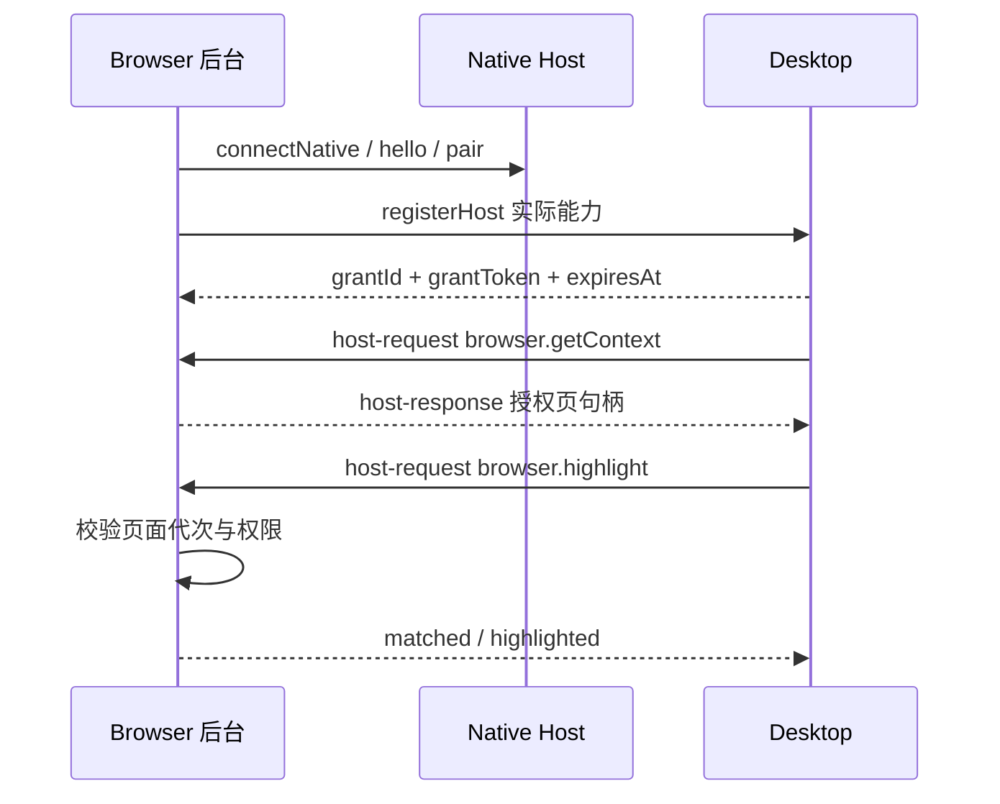

# Browser 可选宿主扩展 browser/1

本扩展可选；七个方法不属于基础连接必需项。每个客户端只声明实际实现且当前获准的能力。

双向指的是双向业务调用，连接仍由扩展后台发起。复用同一 Native Port，Desktop 经 Host 下发受限命令；无需扩展监听 TCP，也不依赖任意远程调试协议。`sendNativeMessage` 的单次调用模型不用于反向通道。

## 授权与路由

registerHost 要求当前有效本机会话及 host:register；Browser 完成本地连接模式切换后才登记实际能力。参数携带 extensionId=browser/1。返回的 grant 绑定 connectionId、当前授权、稳定 pairing owner、workspaceId/generation 与能力集合，最长 10 分钟；重复登记产生新 grant 并废止旧 grant。断线、退出连接形态、撤权、切换工作区立即失效。内容脚本没有 grantToken。

每个反向请求带独立 requestId（传输相关）和 invocationId（业务重试相关）。接收端验证 grantToken、连接代次、工作区、能力、deadlineAt，再执行。截止时间不超过发送后 30 秒；一般 5 秒读/15 秒动作。超过截止未开始则 DEADLINE_EXCEEDED；开始后超时则结果未知，查询 getOperation。已完成动作不能因超时自动再开一个标签页。

按稳定 owner + invocationId 保存方法/参数摘要、来源 sourceGrantId、终态与完整回执至少 7 天；原 grant 即使过期或断线，回执保留不随其立即删除。来源 grant 的 owner 和撤权状态等最小校验元数据也必须同期限保留，旧 token 不用于恢复，也不需要随回执保留明文。同有效 grant 内同载荷返回原结果，不同载荷拒绝；新 grant 禁止重执行旧 invocationId，返回 OPERATION_RECOVERY_REQUIRED 后只读查询。取消是尽力操作，已经打开的来源不能用 cancelled 假装回滚。

例如桌面要求打开来源，Browser 已打开标签页但 ACK 丢失。重连后重新 registerHost，再调用 browser.getOperation({sourceGrantId:旧grant, invocationId:原调用})。新 grant 必须有效，且新旧 grant 的 owner 六字段完全一致；源码端必须再次确认配对未撤销和资料世代未切换。满足这些条件才允许读取终态/摘要，不能执行动作、改变历史回执或恢复旧 grant。

返回完整 receipt 还必须具备原方法 capability；带页面句柄的内容必须仍被授权且 documentRevision 一致；getContext 中返回的页面也受此限制。新授权收窄、页面导航或权限取消时返回原终态/resultDigest、receipt:null、contentStatus:not-authorized。未找到或保留期结束为 unknown，不能猜测失败并自动重执行。完整撤权、账号/世代/配对改变时连终态都禁止恢复，不允许使用 getOperation 控制面扩大权限。

getOperation/cancelOperation 是已授任意 host grant 的控制面，不额外要求 context 读取权限；cancelOperation 只能取消当前 grant 的未执行调用；getOperation 只读恢复同一 owner 的来源 grant 调用，完整内容遵守上述权限复核。能力登记最多 5 项，不支持的方法返回 CAPABILITY_UNAVAILABLE，不能谎报 success。

## 页面授权

getContext 只返回用户在插件中选定并授权给当前连接的阅读页，不枚举全部标签或历史。pageHandle 是后台生成的临时 UUID，内部映射真实 tab/document，不接受桌面传入任意 tabId。documentRevision 在导航、重载或被选中正文变化时更新；旧句柄/旧文档调用返回 PAGE_STALE。

readSelection 最多 4000 字符；ranges 是返回 text 内的 UTF-16 半开范围。必须有插件中明确的页面/选区共享操作，桌面配对不等于无限读取网页正文。没有选区返回空 text/ranges，不自动退回读取整页。限制页、无权限站点和未授权页面明确失败。highlight 只按 exact/prefix/suffix 定位文字，不接受 CSS、JS 或脚本字符串执行。

openSource 仅接受 http/https、无账号密码的 URL，并由用户在桌面发起；恶意 scheme、文件路径、浏览器内部页拒绝。不得把浏览器 cookie、登录会话、网页 HTML、表单或任意历史记录作为宿主能力返回。新的读取范围需要独立 capability 和授权。

## 侧栏的真实限制

Chrome 的 sidePanel.open 要求浏览器认可的用户手势。桌面点击或 Native 消息不能被假定为这种手势。因此 requestSidePanel 可以返回 `requires-user-action` 和 actionId：插件展示自己的待办入口，用户在插件中点击后打开侧栏。能力可用不等于每次都能自动打开，不能用普通网页 Tab 伪装原生侧栏成功。见 [Side Panel 官方说明](https://developer.chrome.com/docs/extensions/reference/api/sidePanel)。

同一桌面可连接多个浏览器 profile，每个有独立 clientInstanceId、grant 和页面句柄。Desktop 选择明确目标实例，禁止广播采集、打开或朗读。插件未运行时返回 HOST_UNAVAILABLE，不轮询唤醒日常浏览器。

具体结构见[反向 Schema](../../schemas/browser-host.v1.schema.json)、[方法表](../../host-methods.json)及[接口规范](../接口规范.md)。
