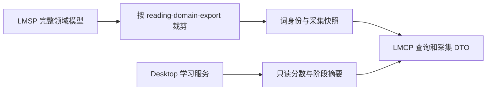

# 词身份、采集与展示结构

LMCP 仅保留本机遇见/采集使用的模型。schemas/reading-domain.v1.schema.json 从 LMSP 维护的完整 domain 模型按依赖裁剪；两仓的这份小型快照必须同哈希。LMCP 不复制学习 profile、FSRS 向量、练习模型或云端同步服务。

## 稳定身份

公共词使用 Dictionary 0.0.3 的 entryId、release、entrySchema=leximeet.entry.v2。entryId 是身份，normalized、拼写、大小写归一化结果不是身份。资源 Lite/Core/Full 仅影响覆盖范围，不改变同一 entryId 的含义。

自定义词使用 customId、headword、language=en；同拼写的两个 customId 不自动合并。matchWords 有多个候选时由用户或明确规则选择，不能随便选第一项再永久合并。

UUID 小写；revision 用十进制字符串，不转成 JavaScript Number。UTC 时间使用毫秒精度；文字范围使用 UTF-16 半开区间，不能拆代理对。

## 私人内容边界

用户内容仅保留词笔记与语境笔记，分类使用单词本。词卡 personal 为 null 或 {note}，采集 annotation 为 {note}；不再定义 personalMeaning、meaningSupplement 或用户自定义标签。公共字典释义仍通过 getPublicEntry 返回。首次正式发布前直接采用新结构，不发送旧字段的空值作为兼容占位。

## 只读词卡

getWord 返回词身份、私人笔记摘要、collected、inTarget、资源状态及 learning.status/score/asOf。学习值由 Desktop 计算，插件只展示；getPublicEntry 按稳定 ID 返回公共词卡。

inTarget 表示当前公共学习目标成员资格；有效遇见范围为 inTarget=true 或未回收的 collected=true 私人词。matchWords 对桌面当前资源和私人词作查询，按 inputIndex 返回每个输入结果；无法完全返回的候选标 complete=false。不能因 Browser Lite 缺词而提前过滤掉候选。

资源缺失时保留身份与私人资料，显示 missing；不能按拼写新建另一份词。查词、匹配和词卡展示不创建采集或学习事实。

## 原子采集

recordEncounter 的 eventId 标识一次采集事实，mutationId 标识一次提交意图。输入包括词身份、原句、保存片段、surface、两组文字范围、笔记、来源与可选词本。

仅接受 web/manual 且 collectionIntent=collect。web URL 只允许 http/https，无用户密码和 fragment；manual URL 必须为 null。内容最多 20000 字符并服从帧预算；禁止全文、cookie 和无关浏览器历史。实际采集操作授权保存对应内容。

Desktop 校验词身份、范围、来源与词本，原子保存必要私人覆盖、遇见事实、词本关系、修订和回执；web/manual 采集置 collected=true。已有私人笔记不被空输入覆盖，采集注释保存在这条遇见事实中。不能自动复活回收词，也不能创建不存在的词本。

客户端不提交 occurredAt、timeZone、origin、score 或学习规则；Desktop 使用可信接收时钟、工作区时区和实际写入设备生成事实。超时重试保留原事实时间。插件是命令来源，后续云 outbox 仅由 Desktop 生成。

跨 mutationId 复用相同 eventId 且内容/词本相同返回原结果，不重复添加事实；内容不同拒绝。事实去重在工作区内，操作回执按配对 owner 隔离。正式 1.0.0 不自动清理成功业务回执或采集事实。

## 结构兼容

请求严格校验未知字段，防止输入意图被静默忽略。响应允许新增可选字段，消费端读取已知字段；未知业务枚举或能力不能自动当作成功。原始资料与学习同步模型的完整规则由 LMSP 维护，不通过本机 API 改写。
