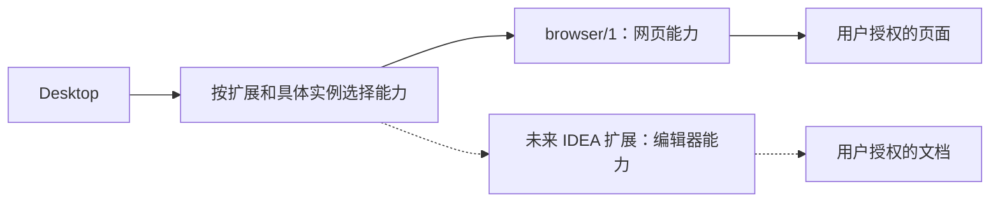

# 可选宿主扩展

插件向 Desktop 调用业务 API；Desktop 可以按需调用插件提供的宿主能力。这两个方向复用传输通道，但能力集合分别管理。

基础 16 个方法不依赖反向调用。只有 Desktop 声明 host.registration/1 且客户端需要提供宿主功能时，才调用 registerHost。不存在可用扩展时，遇见与采集照常工作。

登记参数包含 extensionId 与客户端实际实现的 capabilities。Desktop 只接受双方认识且获准的能力；未知扩展/能力返回 CAPABILITY_UNAVAILABLE，不作为任意 RPC 或脚本入口。结果返回明确的授权能力集合、当前 owner、grantId/token 与有效期。

扩展清单以 [extensions.json](../extensions.json) 为准。目前仅定义可选 [browser/1](extensions/browser.md)；IDEA 实际接入时新增命名空间、输入输出 Schema、权限、错误、样例及验收，不要求实现 Browser DOM 方法。

可以借鉴 MCP 的能力发现与类型化参数，但不引入 MCP 运行时依赖。动态发现只告诉调用方“提供哪些能力”，业务含义与调用适配仍需实现。参见 [MCP Tools](https://modelcontextprotocol.io/specification/2026-07-28/server/tools)。

同一 Desktop 可连接多个客户端实例；每个授权绑定明确实例与连接，不能广播读取或执行。断线、disconnect、撤权或工作区变化立即使当前宿主授权失效。Host 请求不会访问 Browser 封存资料或恢复其账号。
