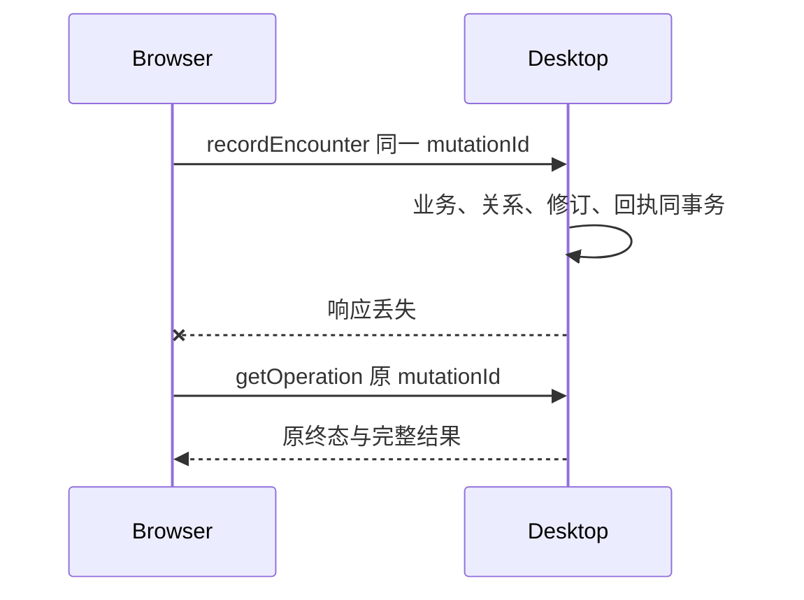

# 桌面本机 API 规范

合同与 API 版本均为 1.0.0。方法表是白名单，Schema 是结构依据，本页与状态/数据文档定义行为。16 个必需方法覆盖连接、读取、采集与导航；3 个可选方法仅在能力声明后调用。

## 帧、授权与回执

请求包含 apiMajor、requestId、connectionId、method、params；authorization 是否必填见方法索引。无需业务会话的方法仍须遵守真实 origin、当前 hello 登记、邀请票据或配对凭据的相应检查，不能据此访问私人资料。requestId 标识本次传输，mutationId 标识可重试业务意图；重试更换 requestId，保留 mutationId 与原载荷。

响应回显 requestId、connectionId、method，携带 apiVersion 和 ok。ok=true 返回 result；ok=false 返回 code/message/retryable，可选 retryAfterMs。不能将未知错误当作成功，不能把超时当作未提交。

业务幂等键为完整配对 owner 加 mutationId；指纹为 method 与 params 的 JCS SHA-256。成功或业务拒绝的回执不被新请求覆盖；相同 ID 不同载荷返回 IDEMPOTENCY_KEY_REUSED。事务中断未提交时允许同 ID 重试。正式 1.0.0 不自动清理业务回执。



先鉴权和校验实际连接、工作区、授权代次，再查回执。对外禁止任意方法转发。严格请求拒绝未知字段；响应的未知可选字段可以忽略。

## 方法索引

| 方法 | 要求 | 能力 | scope | 业务会话 |
| --- | --- | --- | --- | --- |
| hello | 必需 | lmcp.connection/1 | 按会话/控制规则 | 不需要 |
| requestConnection | 必需 | lmcp.connection/1 | 按会话/控制规则 | 不需要 |
| getConnectionStatus | 必需 | lmcp.connection/1 | 按会话/控制规则 | 不需要 |
| pair | 必需 | lmcp.connection/1 | 按会话/控制规则 | 不需要 |
| resumeSession | 必需 | lmcp.connection/1 | 按会话/控制规则 | 不需要 |
| renewSession | 必需 | lmcp.connection/1 | 按会话/控制规则 | 需要 |
| revokePairing | 必需 | lmcp.connection/1 | 按会话/控制规则 | 需要 |
| disconnect | 必需 | lmcp.connection/1 | 按会话/控制规则 | 需要 |
| getWorkspace | 必需 | desktop.reading/1 | library:read | 需要 |
| matchWords | 必需 | desktop.reading/1 | library:read | 需要 |
| getWord | 必需 | desktop.reading/1 | library:read | 需要 |
| getPublicEntry | 必需 | desktop.reading/1 | library:read | 需要 |
| recordEncounter | 必需 | desktop.capture/1 | capture:write | 需要 |
| getChanges | 必需 | desktop.reading/1 | library:read | 需要 |
| getOperation | 必需 | lmcp.connection/1 | 按会话/控制规则 | 需要 |
| openInDesktop | 必需 | desktop.navigation/1 | navigation:open | 需要 |
| listNotebooks | 可选 | desktop.notebooks/1 | library:read | 需要 |
| listEncounters | 可选 | desktop.encounters/1 | library:read | 需要 |
| registerHost | 可选 | host.registration/1 | host:register | 需要 |

## 方法行为与参数示例

以下静态 params 摘自可校验样例。hello 的摘要随规范变动自动生成，应从当前合同读取。完整信封与响应见 [fixtures/contracts.json](../fixtures/contracts.json)，字段范围见 [Schema](../schemas/desktop-api.v1.schema.json)。

### hello

查询兼容版本和能力；未授权时不返回私人信息。

只返回公开实例身份、兼容信息与方法。requiredCapabilities 必须包含本客户端实际依赖的能力；基础客户端需要四项核心能力。版本协商见配对文档。

本页也属于摘要输入，不能在正文内嵌自身的最终摘要。完整有效示例为 fixtures 中的 hello-request；在仓库根目录执行以下命令即可读取：

```sh
node -e 'console.log(JSON.stringify(require("./fixtures/contracts.json").find(x => x.name === "hello-request").value.params, null, 2))'
```

客户端构建时从 contract.json 固定 contractVersion 与 contractDigest，运行时生成本连接的 connectionId；不能通过抄取对端 hello 的摘要来假装已实现同一合同。

输入：helloParams；成功结果：helloResult。

### pair

通过插件真实确认窗口接受邀请，建立配对并直接签发业务会话，不上传独立资料。

插件确认后建立持久配对并签发可直接调用业务 API 的会话。请求不携带独立账号、资料或归档。票据来自指定客户端邀请流程，且必须由插件真实用户确认后提交。

```json
{
  "clientInstanceId": "11111111-1111-4111-8111-111111111111",
  "invitationId": "11111111-1111-4111-8111-111111111111",
  "invitationToken": "aaaaaaaaaaaaaaaaaaaaaaaaaaaaaaaaaaaaaaaaaaa"
}
```

输入：pairParams；成功结果：pairResult。

### resumeSession

使用原配对恢复同一桌面工作区会话。

请求携带已保存的六字段 owner 与 pairingToken，实际连接使用新的 connectionId。服务端核对当前身份；更换资料、账号授权代次或撤权后不能恢复旧权限。

```json
{
  "pairingId": "11111111-1111-4111-8111-111111111111",
  "desktopInstanceId": "11111111-1111-4111-8111-111111111111",
  "clientInstanceId": "11111111-1111-4111-8111-111111111111",
  "workspaceId": "11111111-1111-4111-8111-111111111111",
  "generation": "11111111-1111-4111-8111-111111111111",
  "authorizationEpoch": "1",
  "pairingToken": "yyyyyyyyyyyyyyyyyyyyyyyyyyyyyyyyyyyyyyyyyyy"
}
```

输入：resumeSessionParams；成功结果：resumeSessionResult。

### renewSession

续发当前已授权会话。

续发同一连接的新会话，旧会话保持原到期时间供在途操作完成。续发不恢复独立账号，不重新配对。

```json
{}
```

输入：renewSessionParams；成功结果：renewSessionResult。

### revokePairing

撤销当前设备配对及其全部会话和宿主授权。

仅允许撤销当前会话自己的 pairingId。完成后配对、全部会话和宿主 grant 失效。响应丢失也不为回执查询重新授权；旧凭据恢复应失败。

```json
{
  "pairingId": "11111111-1111-4111-8111-111111111111"
}
```

输入：revokePairingParams；成功结果：revokePairingResult。

### disconnect

结束当前连接的全部会话和宿主授权，保留设备配对信任。

持久标记当前 pairingId 为 disconnected，结束该配对全部会话及宿主 grant，保留配对信任但禁止自动 resume。恢复封存 A 是 Browser 的本地动作，不向 Desktop 提交资料。响应丢失可在本地关闭通道并恢复独立，记录未确认的远端结束状态。

```json
{}
```

输入：disconnectParams；成功结果：disconnectResult。

### getWorkspace

读取绑定身份、桌面账号摘要和资料修订。

返回授权后的完整 owner、工作区 revision、词典资源、Desktop 账号展示摘要、同步展示状态和只读租期。首次应用 1.0.0 account.status=unavailable、cloudSync=disabled。账号摘要固定 source=desktop，不能赋值给插件自己的登录状态。没有计划、练习或草稿内容，不返回云 token。

```json
{}
```

输入：getWorkspaceParams；成功结果：getWorkspaceResult。

### matchWords

批量匹配候选词并返回桌面当前展示摘要。

支持稳定 WordRef 数组或 token 数组，一次 1—100 项。每个输入恰有一个 inputIndex 对应结果，最多 10 个候选；不完整时 complete=false。先按原文精确词头，再按词典声明的查询键匹配，保留不同身份；同级按 wordKey ASCII 排序。候选多义时不能自动把第一项当作唯一身份。inTarget 与 collected 供插件判断有效遇见范围。返回 asOf 与最长 30 秒的 refreshAfterMs。

```json
{
  "kind": "ids",
  "words": [
    {
      "kind": "dictionary",
      "entryId": "7fb01ea7-0fab-5cc5-8723-d902d6a16c99",
      "release": "0.0.3",
      "entrySchema": "leximeet.entry.v2"
    }
  ]
}
```

输入：matchWordsParams；成功结果：matchWordsResult。

### getWord

读取一张词卡的私人摘要与学习展示值。

返回当前词卡的私人摘要与 Desktop 计算的状态/分数；无需客户端实现 FSRS。未收藏的合法公共词可以读取，personal=null。资源缺失明确返回 resourceStatus，不能按拼写重新建词。响应的 refreshAfterMs 限制时间投影缓存。

```json
{
  "word": {
    "kind": "dictionary",
    "entryId": "7fb01ea7-0fab-5cc5-8723-d902d6a16c99",
    "release": "0.0.3",
    "entrySchema": "leximeet.entry.v2"
  }
}
```

输入：getWordParams；成功结果：getWordResult。

### getPublicEntry

按稳定身份读取公共词卡。

按 entryId/release 返回符合 Dictionary 0.0.3 词条结构的公共词卡。资源不可用返回 RESOURCE_UNAVAILABLE，不捏造空词卡或替换 ID；超过帧预算返回 PAYLOAD_TOO_LARGE，不截断结构后谎称成功。

```json
{
  "entryId": "7fb01ea7-0fab-5cc5-8723-d902d6a16c99",
  "release": "0.0.3"
}
```

输入：getPublicEntryParams；成功结果：getPublicEntryResult。

### recordEncounter

原子保存一次采集、必要私人覆盖和词本关系。

原子完成一次采集，eventId 是事实身份，mutationId 是提交意图。notebookId=null 表示不额外添加指定词本关系，已有关系不删除；非空必须引用当前工作区有效词本。源内容不允许来自剪贴板策略，词、范围和 URL 必须通过语义验证。Desktop 生成 origin/timeZone/occurredAt，不接受插件自报学习分数。相同 eventId 的相同内容返回原事实，不重复添加。

```json
{
  "eventId": "11111111-1111-4111-8111-111111111111",
  "data": {
    "word": {
      "kind": "dictionary",
      "entryId": "7fb01ea7-0fab-5cc5-8723-d902d6a16c99",
      "release": "0.0.3",
      "entrySchema": "leximeet.entry.v2"
    },
    "surface": "photosynthesis",
    "originalSentence": "Plants use photosynthesis.",
    "savedExcerpt": "Plants use photosynthesis.",
    "occurrenceRanges": [
      {
        "start": 11,
        "end": 25
      }
    ],
    "excerptRanges": [
      {
        "start": 11,
        "end": 25
      }
    ],
    "annotation": {
      "note": "在文章中采集的真实语境"
    },
    "source": {
      "kind": "web",
      "title": "示例文章",
      "url": "https://example.invalid/article"
    },
    "collectionIntent": "collect"
  },
  "notebookId": null,
  "mutationId": "11111111-1111-4111-8111-111111111111"
}
```

输入：recordEncounterParams；成功结果：recordEncounterResult。

### getChanges

比较工作区修订并续只读缓存租期。

sinceRevision 必填。返回当前 revision、是否不同及 readLeaseUntil；不返回实体日志、游标或整库内容。changed=true 后重查活动视图；changed=false 仍须遵守词卡 refreshAfterMs，以反映时间衰减。高于当前修订的输入视为工作区状态不一致，重新读取上下文。

```json
{
  "sinceRevision": "0"
}
```

输入：getChangesParams；成功结果：getChangesResult。

### getOperation

只读查询当前配对归属的原始业务回执。

只查询当前 owner 下的业务操作。status=unknown 不证明提交失败，不允许换 ID 自动重放；pending 等待；applied 携带原方法及完整结果；rejected 携带原终态错误。查询还需原方法的权限，不能用控制面绕过 capture:write 或 navigation:open。

```json
{
  "mutationId": "11111111-1111-4111-8111-111111111111"
}
```

输入：getOperationParams；成功结果：getOperationResult。

### openInDesktop

在桌面打开词库、规划、设置或指定词。

target 只允许 library、plan、settings 或带 WordRef 的 word，不接受任意路径、URL、脚本或系统命令。opened=true 表示桌面窗口路由已接受动作，不保证操作系统允许抢占焦点。优先定位现有窗口；以 mutationId 保存动作回执。跨进程动作先记 pending，崩溃结果未知时不自动重复打开窗口。

```json
{
  "target": "library",
  "mutationId": "11111111-1111-4111-8111-111111111111"
}
```

输入：openInDesktopParams；成功结果：openInDesktopResult。

### listNotebooks

可选：读取采集可选词本，不提供词本管理。

可选 desktop.notebooks/1。只返回未回收的可选词本，按 entityId ASCII 升序；limit 默认 100、最大 100。cursor 绑定 owner、查询条件与工作区 revision，资料变化或 5 分钟到期返回 CURSOR_EXPIRED，从第一页重查。不提供创建、编辑、删除。

```json
{}
```

输入：listNotebooksParams；成功结果：listNotebooksResult。

### listEncounters

可选：分页读取指定词的有效语境。

可选 desktop.encounters/1；word 必填，仅返回该词未被有效撤销的语境。按 occurredAt 降序、entityId ASCII 升序分页；limit 默认 20、最大 100。from/to 是 Desktop 工作区时区的包含端点日期，from 不得晚于 to。cursor 与查询条件、owner、revision 绑定，变化或 5 分钟到期重查。

```json
{
  "word": {
    "kind": "dictionary",
    "entryId": "7fb01ea7-0fab-5cc5-8723-d902d6a16c99",
    "release": "0.0.3",
    "entrySchema": "leximeet.entry.v2"
  }
}
```

输入：listEncountersParams；成功结果：listEncountersResult。

### registerHost

可选：登记当前插件已实现且获准的宿主扩展能力。

可选 host.registration/1。extensionId 与实际实现且获准的 capabilities 显式登记；不接受未知扩展或能力。结果列出 Desktop 接受的能力，grant 绑定实际连接与 owner，最长 10 分钟。没有共同能力返回 CAPABILITY_UNAVAILABLE；不影响基础连接。

```json
{
  "capabilities": [
    "browser.context/1"
  ],
  "extensionId": "browser/1"
}
```

输入：registerHostParams；成功结果：registerHostResult。

## 主要错误

| 错误 | 消费端处理 |
| --- | --- |
| UNSUPPORTED_VERSION / CONTRACT_MISMATCH | 停止接入，匹配所需版本或候选 |
| CAPABILITY_UNAVAILABLE | 必需能力则停止连接；可选能力则禁用入口 |
| CONNECTION_ENDED | 本人已明确断开；恢复封存 A、停止自动重连 |
| INVITATION_EXPIRED / INVITATION_CANCELLED | 未接受邀请过期或取消；确认未应用后可解除 preparing |
| SESSION_EXPIRED / STALE_CONNECTION | 重新 hello 并恢复会话，不切回独立写入 |
| PAIRING_REVOKED / UNAUTHORIZED / FORBIDDEN | 停止访问，按实际原因重新授权 |
| GENERATION_MISMATCH | 失效旧上下文；不能把旧请求转向新空间 |
| IDEMPOTENCY_KEY_REUSED / EVENT_ID_REUSED | 提交标识被复用，保留原事实与回执 |
| ENTITY_NOT_FOUND / ENTITY_DELETED | 刷新关联资料；不创建或复活来掩盖错误 |
| RESOURCE_UNAVAILABLE | 显示资源不可用，保留稳定词身份 |
| INVALID_OCCURRENCE_RANGE / INVALID_SOURCE_URL | 修正采集输入；不能静默截断 |
| CURSOR_EXPIRED | 仅适用可选列表分页；从第一页重查 |
| PAYLOAD_TOO_LARGE | 缩小批量或内容，不能拆成重复业务意图 |

配对、断开和撤权是控制动作，不使用采集回执假装业务回滚。已完成动作与未知结果的区别见 [连接与恢复](连接与恢复.md)。

### requestConnection

主动发起或取消自己当前客户端的连接邀请，不产生业务授权。返回 `ConnectionStatus`，完整语义见[自动发现与连接邀请](自动发现与连接邀请.md)。

```json
{
  "clientInstanceId": "11111111-1111-4111-8111-111111111111",
  "action": "request"
}
```

### getConnectionStatus

只读查询邀请和本人已明确断开/撤权状态；无私人资料。返回 `ConnectionStatus`，完整语义见[自动发现与连接邀请](自动发现与连接邀请.md)。

```json
{
  "clientInstanceId": "11111111-1111-4111-8111-111111111111"
}
```

## 首次发布前的私人字段收敛

getWord.personal 只描述 note；recordEncounter.data.annotation 只接受 note。个人释义、语境释义补充和用户标签不属于当前合同；公共字典释义保留。请求携带已移除字段按未知输入拒绝，消费端应更新 DTO 与冻结副本。API 目标仍为 1.0.0，但本次规范字节与合同摘要改变，需重新构建两端并验证词卡、笔记采集、重试和连接恢复。
