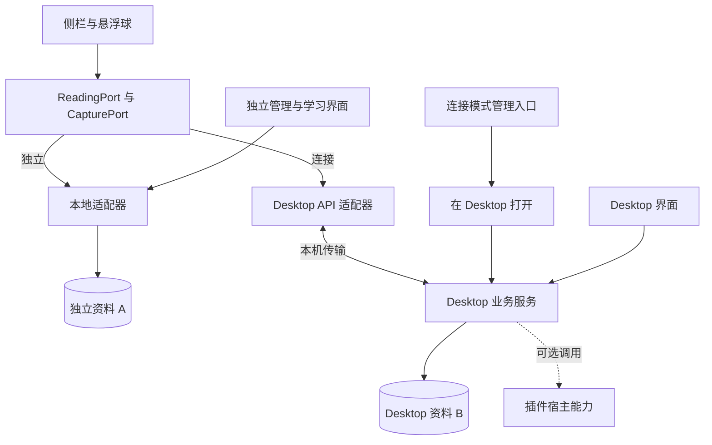

# 两种形态与调用边界

## 一份遇见与采集界面，两种核心适配器

例如在网页采集 apple：独立模式由 Browser 本地业务服务保存；连接模式调用 Desktop recordEncounter，收到桌面回执后展示成功。当前模式由可信后台统一管理，内容脚本不能自己决定写哪份数据库。

ReadingPort 负责候选匹配、词卡和只读摘要；CapturePort 负责采集与回执。独立管理/练习服务保持本地实现，连接模式不展示对应远程管理界面。不要求 Desktop 适配器实现完整 WorkspacePort，也不暴露 SQLite 行、Java 类名或任意数据库访问。

| 项目 | 独立 Browser | 连接 Browser |
| --- | --- | --- |
| 活动业务真源 | 本地资料库 | Desktop 工作区 |
| 管理、计划、练习 | 独立界面与本地核心 | 提示在 Desktop 打开 |
| 设置 | 独立设置 | 仅断开 Desktop |
| 账号与同步（2.0.0） | 自己登录，按用户选择同步 | 自己登出并停用；同步由 Desktop 执行 |
| 独立资料 | 可读写 | 本机封存，不传给 Desktop |
| 宿主能力 | Browser 自己实现 | 仍在 Browser，按单项授权向 Desktop 提供 |

“没有自己的状态”是没有第二份活动业务真源。允许短暂 UI、受限只读缓存、配对凭据和绑定原 owner 的待确认命令；禁止在封存库继续产生私人词、学习状态或云 outbox。未提交采集输入可以保留为原工作区的输入草稿，不能显示为已保存。

连接模式的管理入口提供明确的“在桌面端打开”动作；不自动反复拉起窗口。Desktop 内部继续拥有完整学习、规划和资料管理功能，内部 UI 不必通过 LMCP 调用自身服务。

## 消息与 Browser 传输

核心合同只规定消息与行为；当前具体接入规范是 Browser Native Messaging。浏览器绑定见 contract.json 的 browserBinding。IDEA 等宿主可通过独立传输绑定复用核心 API，出现实际需求时再定义与验证，不宣称本版已经支持其安装与连接。

Browser 可信后台使用 runtime.connectNative，Native Host 校验真实扩展 origin。Host 到 Desktop 使用同用户受限 IPC；Core 独占业务事务，Host 只做帧、来源与白名单转发。内容脚本不能接触会话/配对/云凭据，不建立任意本机 HTTP 访问。

所有方向最多 262144 字节 UTF-8 JSON，不含 Native Messaging 长度头；批量最多 100 项，同时服从字节预算。拒绝重复 JSON 键、孤立代理项和非有限数值。日志走 stderr，stdout 只输出协议帧。

查询默认等待 5 秒，普通写 15 秒。超时是结果未知；采集与导航按原 mutationId 查询或重试。控制面配对、恢复、断开、撤权有各自幂等/失效规则，见配对文档，不把它们伪装成资料导入事务。

## 读取与刷新

matchWords 按候选数组有界查询，返回桌面词身份、目标成员资格、收藏与学习展示值。插件在本地处理 DOM，不发送整个网页，也不先用 Lite 词库过滤掉它不认识的候选词。

getChanges 比较 sinceRevision，返回 changed、当前 revision 和只读租期。changed=true 时重查活动词卡/匹配列表；这不是 LMSP 增量复制接口，不下发整库事件或计划。

时间衰减可能在无新业务写入时改变学习展示，所以 matchWords/getWord 还返回 asOf 与 refreshAfterMs，最多 30 秒。租期、连接、会话及展示刷新期限任一失效即不能继续当作实时数据。断线立即锁定私人展示并进入恢复状态；公共词典缓存不承担私人业务真源。

无须消息中间件。将来的推送只提示重新查询；基础客户端以有界轮询即可恢复。工作区变更、授权代次变化或数据库恢复须使旧会话与私有缓存失效。
