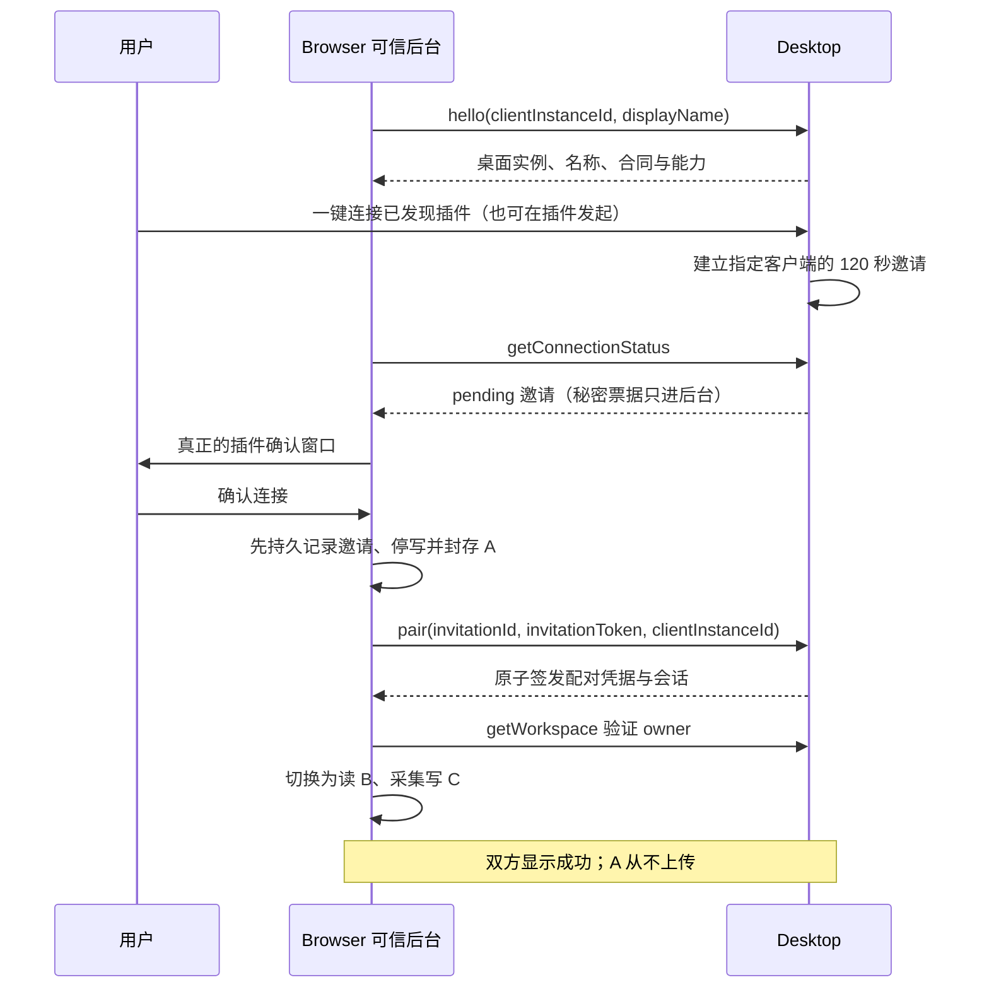
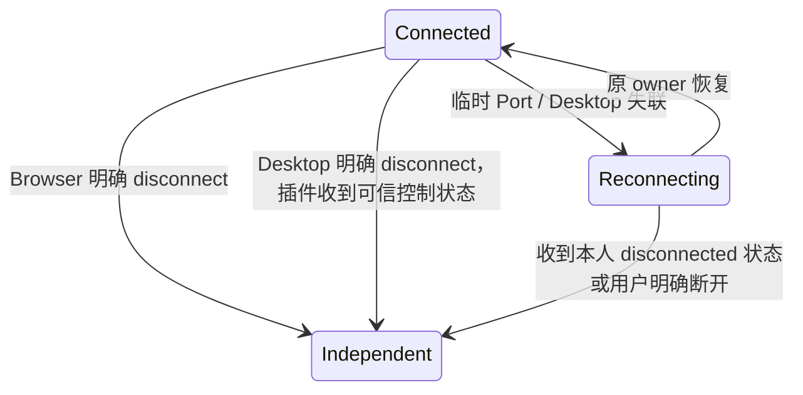

# 自动发现与连接邀请

LMCP 1.0.0 采用「发现 → 任一端发起 → 插件确认 → 自动配对」；配对票据和长期凭据均由可信后台处理，用户不输入配对码。发现不等于连接，也不读取独立资料 A、账号或桌面资料 B。

## 发现与发起

hello 必须携带 clientInstanceId（该插件安装实例的 UUID）和 displayName（1～80 字符）。传输提供可信 origin，hello 的 connectionId 必须等于实际端口。双方只展示安全设备名称，不把 origin 当作用户输入的信任依据。Desktop 的发现登记有界，闲置 60 秒或端口明确关闭后不作为可发起目标；插件可继续在独立模式做安全探测。

requestConnection 的参数是 `{clientInstanceId, action:"request"}`，只允许当前 hello 登记的实际 origin、客户端与端口发起；不会签发业务会话。Desktop 的本机管理入口为用户指定已发现目标建立同等邀请。每个目标最多一个有效 pending 邀请，重复点击返回同一邀请而不延长 120 秒期限；当前已连接且未明确断开的目标拒绝重复邀请。

用户在插件窗口取消时调用 `{clientInstanceId, action:"cancel", invitationId}`。Desktop 也可取消自己的待确认邀请。双方看到 cancelled；已经 accepted 的邀请不可取消，应明确 disconnect。通知、Renderer、内容脚本、URL、截图和日志均只得到邀请 ID、名称和状态，不得到 invitationToken。

## 状态查询与确认

getConnectionStatus 参数包含 clientInstanceId，可选 pairingCredential、invitationId。结果为：

- desktopInstanceId、displayName：安全设备元数据。
- connectionState：unpaired / connected / disconnected / revoked。只有验证过自身配对凭据时才提供配对控制状态；未带凭据为 unpaired。
- invitationState：none / pending / accepted / cancelled / expired。
- invitation：pending 时为 invitationId、invitationToken、requestedBy（desktop / plugin）、expiresAt，其余为 null。该对象只交付可信后台。

查询本身不配对、不续业务会话、不读账号/词卡/工作区、不修改业务资料。配对凭据在业务授权已结束后只用于确认本人已断开或撤权，不能换取资料读取权限。错误凭据仍拒绝，不能借状态查询枚举别人的配对。

pair 仅接受 invitationId、invitationToken、clientInstanceId。初次接受必须在 120 秒内，并匹配创建邀请时的实际 origin、客户端、桌面实例及当前 hello 登记的实际连接。插件必须先取得真实用户确认，再封存 A，最后调用 pair；不能静默接受 Desktop 邀请。

## 配对结果未知

可信后台先持久保存 pending 邀请票据，再封存 A、发送 pair。初次接受一次完成；同一已应用邀请可在新端口 hello 后重放，返回同一 pairingCredential 与当前端口的新会话，不重复创建配对，不轮转原长期凭据。120 秒只限制未接受的邀请，不截断已应用结果的恢复。Core 重启后仍能验证已应用票据；服务端仅保存秘密哈希。

明确 cancelled / expired 且服务端没有接受记录时可解除 preparing 并恢复 A（账号保持退出）。网络失败或结果未知时保持 A 封存，查原 invitationId、重放原票据，不能换一个邀请或擅自恢复本地写入。已应用邀请在用户明确断开、撤权或新的主动连接替换后不能再恢复原授权。

## 任一端明确断开

Browser disconnect 和 Desktop 本机管理 disconnect 都持久标记该配对 disconnected，结束全部会话及宿主 grant。getConnectionStatus 可用原凭据查询本人断开状态；resumeSession 返回 CONNECTION_ENDED。插件收到这一明确控制结果后停止重连、隔离未知采集并恢复 A。信任记录可保留，但下一次连接必须重新发起邀请并得到插件确认。

connectionClosed、进程崩溃、读取超时仅结束当前端口会话，不写 disconnected 标记；插件保持封存 A 和 reconnecting。revokePairing 表示设备信任撤销，返回 revoked 控制状态，不伪装成普通失联；已经写入的 B+C 不因任何断开或撤权回滚。

## 验收边界

规范 Schema、状态参考测试与应用真实实现分别验收。必须验证双方主动发起、真实插件窗口确认/取消、双方成功提示、任一端断开、临时失联、邀请过期、跨 origin/client 拒绝、已应用 pair ACK 丢失/重启恢复，以及连接采集仍只写 Desktop 一次。应用验收前不能把这些合同样例当作运行证明。
