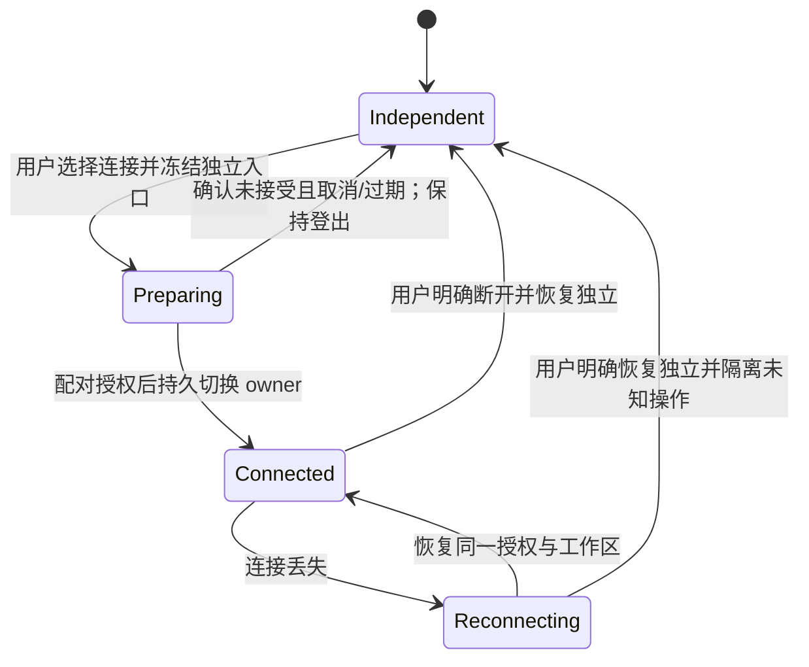
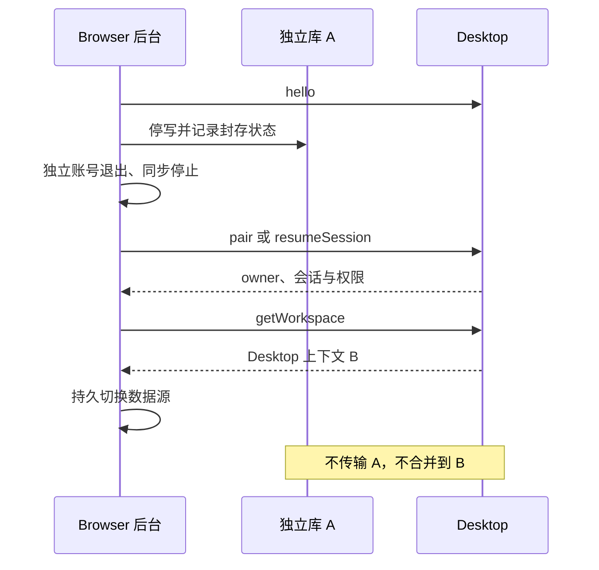

# 封存独立资料、连接与恢复

本机连接只切换数据源，不导入、不合并，也不迁移独立计划、学习事件或练习草稿。正式发布前的旧候选无需双栈兼容。

## A 与 B 的边界

| 阶段 | 插件活动数据 | Desktop | Browser 原资料 |
| --- | --- | --- | --- |
| 独立 | A | B | A 活动 |
| 连接后 | B | B | A 封存 |
| 连接中采集 C | B+C | B+C | A 不变 |
| 明确断开恢复独立 | A | B+C | A 恢复活动 |

既有云同步可能已使 B 包含 A 的部分事实；本机连接本身不会传输这些事实。封存可以冻结原数据库，不强制生成导出文件或第二份全库副本。

## 独立到连接

1. hello 安全发现并检查合同和能力；任一端发起邀请，用户在真正的插件窗口确认。秘密票据只由可信后台保存。
2. 可信后台取得独立资料写锁，阻止侧栏、浮球、旧管理页与后台任务产生新写入，等待已开始的本地事务结束。
3. 持久保存独立资料身份与切换日志，冻结 A。独立账号退出、刷新/登录功能停用、云任务停止；不归档可恢复登录的令牌。
4. pair 或 resumeSession 获取当前授权，getWorkspace 验证桌面与工作区身份；没有资料分页、冲突预览或提交合并步骤。
5. 在本地原子持久化 owner 与 providerEpoch 后启用 Desktop 适配器，再开放遇见和采集。旧异步响应不得越过代次检查。

pair 成功表示服务器已授予本机 API 权限，不代表 Browser 已完成本地模式切换。Browser 完成第 5 步前不得发送业务写入。结果未知保持 A 封存；确认未接受且已取消/过期才恢复 A，恢复时仍然登出。

## 连接中断与恢复独立

临时断线只进入 reconnecting，不自动恢复 A，不离线保存一份新的 Browser 采集事实。用户明确点击断开并恢复独立时：

1. 停止新命令，尽可能查询在途结果。未知结果保留在原 owner 的恢复日志，不自动重放。
2. Desktop 可达时调用 disconnect，再关闭通道；它持久标记 disconnected，结束该配对全部会话和宿主授权。已经提交的资料保持不变，断开不表示回滚。
3. Desktop 不可达也允许在本地结束连接并恢复 A；记录未确认的远端结束状态，不伪造成功 ACK。关闭通道、停止回调；重连前补处理旧连接失效。
4. 原子切回独立 owner，递增 providerEpoch，解除 A 的冻结。独立账号保持退出，云同步保持停用，未提交的连接采集不转换成 A 的事实。

Desktop 本机管理断开具有相同明确含义；插件可用原凭据查询本人控制状态，收到 disconnected 后恢复 A。disconnect 保留受保护的设备信任，下一次用户主动连接必须重新邀请并确认。显式断开后禁止自动重连。revokePairing 则撤销设备信任。二者都不删除 Desktop 资料。

业务事务与 disconnect/撤权按同一授权边界串行判定：在结束动作之前提交的写入保留；结束后不得以旧会话开始新写入。已发送但结果未知的命令仍需按原身份恢复回执。

## 账号与后台任务（应用 2.0.0）

连接状态中的账号固定标记 source=desktop，仅为 Desktop 提供的展示上下文，桌面未登录也能本机连接。Desktop 云 token 不下发；Browser 不以桌面账号再注册一个云同步设备。

退出 Browser 当前设备会话，不调用全账号退出其他设备。Browser 原账号与 Desktop 账号允许不同；封存 A 保留原账号/云空间绑定元数据，不能因本机连接改绑到 Desktop 账号。

在途云响应始终绑定发出时的账号、空间和代次；切换后只进入原身份的隔离恢复记录，不能改变活动 Desktop 数据、重启账号功能或唤醒同步。所有账号与云任务入口检查当前模式，不能只禁用 UI。

恢复独立后重新登录不自动同步；明确选择原绑定空间并启用同步后才能推进。登录另一账号不得静默上传封存资料。

## 崩溃与多窗口

持久保存独立库标识、当前模式、owner、providerEpoch、已知回执和待确认命令。owner 包含 pairingId、desktopInstanceId、clientInstanceId、workspaceId、generation、authorizationEpoch。每个异步请求捕获 owner 与代次，返回时再次校验。

重启依据切换日志恢复；preparing 不开放写入，connected 先恢复授权，独立模式不自动连接。Desktop 切换工作区/账号、恢复数据库或撤权使旧上下文失效；不能将旧待确认采集投向新空间。

正式 1.0.0 后，封存 A 与活动库同样属于用户资料，后续升级必须保护和迁移，不能因长时间未启用而清空。
