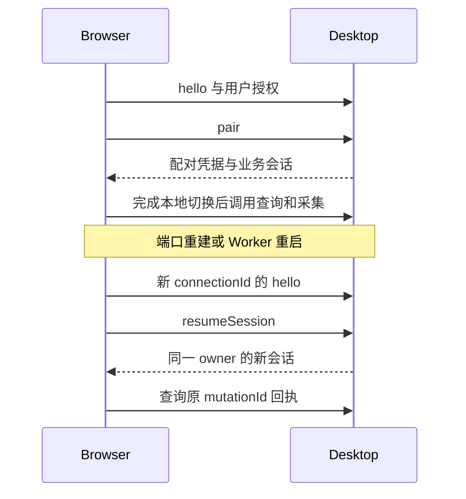

# 配对、会话与兼容协商

## 三种身份

| 身份 | 作用 | 生命周期 |
| --- | --- | --- |
| 配对 | 受信任设备访问特定 Desktop 工作区 | 用户或桌面撤销前保留 |
| 会话 | 当前实际连接可使用的业务授权 | 最长 24 小时，断开/撤权可提前结束 |
| 云账号 | 独立设备的云端身份 | 由账号服务管理，不进入本机令牌 |

可信来源由传输实际提供，不能信任消息自报的扩展 ID。Browser Host 限定 allowed_origins，禁止通配；本机 IPC 限定同一用户与受控进程。新传输绑定必须提供等价身份与消息隔离验证。

## 首次配对与恢复

hello 安全发现；任一端可发起指定客户端的 120 秒邀请，用户在真实插件确认窗口接受后后台调用 pair。用户不输入配对码。邀请和恢复边界见[自动发现与连接邀请](自动发现与连接邀请.md)。读词卡、采集与桌面导航权限在确认窗口说明；宿主读取页面另行授权。

pair 返回 pairingCredential 和 SessionState，直接授权本机 API；没有 preview、attachment 或合并完成前置条件。只授予已实现、已同意的 scopes。核心客户端需要 library:read、capture:write、navigation:open；host:register 可选。

邀请票据与 sessionToken 至少 256 bit 随机熵；pairingToken 必须保持等价秘密强度（可从秘密邀请票据单向派生），服务端仅保存哈希。Browser 可信后台安全存储配对凭据，不放内容脚本、日志、归档或 URL。私密窗口等无法提供持久隔离的上下文不启用本机配对。

owner 的六字段固定绑定设备与资料。session 还绑定实际 connectionId、可信 origin。每次端口重建生成新 connectionId；用 resumeSession 恢复，旧 sessionToken 不能跨连接复用。renewSession 不提前撤销同一连接仍在途的旧会话，旧会话仍按原过期时间失效。

pair 响应丢失时，使用后台持久保存的同一邀请票据恢复已应用结果；不能猜测凭据或更换邀请绕过结果确认。会话恢复没有独立资料参数，不重新上传任何数据。

Desktop 切换工作区、账号主体、授权代次或恢复数据库时，使旧授权失效。先鉴权和身份校验，再查回执；同名账号显示名不能代替稳定身份。revokePairing 只能撤销调用方自己的 pairingId，桌面设备管理可撤销其他设备。

任一端明确 disconnect 结束该配对全部会话和宿主授权，并持久标记 disconnected，保留配对。控制请求本身不加入资料回执日志；下一次主动连接重新发起邀请并在插件确认，不能 resume 绕过明确断开。revokePairing 响应丢失后，旧凭据恢复应失败，不为查询撤权回执重新放开数据访问。

缓存租期最长 30 秒且不得超过会话 expiresAt。getWorkspace/getChanges 的授权读取可续租，不能延长原会话。连接一旦失效就锁定私人缓存，不等待租期耗尽。

Desktop 明确退出后 Host 返回 DESKTOP_NOT_RUNNING 并关闭端口。重连只重试连接，不无限拉起应用；首次连接或用户点击重试才允许显式启动。崩溃与用户退出应使用受控退出信息区分。

## 必需与可选能力

核心要求 lmcp.connection/1、desktop.reading/1、desktop.capture/1、desktop.navigation/1。hello 返回实际 methods 与 capabilities；缺少必需能力拒绝连接，缺少可选能力只禁用相应功能。

desktop.notebooks/1、desktop.encounters/1、host.registration/1 为可选项。Browser 反向能力是独立的 browser/1 扩展，不要求每个客户端或 Desktop 开启。不得为连接遇见/采集要求 FSRS 或学习合并 profile。

## 版本与摘要

hello 请求包含 apiMajor、minApiVersion、requiredCapabilities、客户端合同版本与摘要；结果包含服务版本、实际能力、方法、桌面实例与摘要。授权前不返回私人账号或工作区资料。

- 首次 1.0.0：构建时固定本仓交付身份；旧 rc/0.x 不提供兼容双栈。
- 正式版本：API major 相同、服务版本满足最低要求且必需能力齐全即可。新增可选扩展或不同交付摘要不能单独成为拒绝理由。
- 未知可选能力忽略，未知必需能力明确失败；扩展内部行为按独立版本管理。

contractDigest 是 sha256-jcs-manifest/1：对规范文件原始字节逐个 SHA-256，再对包含配置摘要与有序文件表的 manifest 做 JCS SHA-256。规范物料由 tools/contract-digest.cjs 的显式清单确定；排除摘要自身、fixtures 和维护说明，避免自引用及无关文档影响。它记录交付物身份，不表示实现或联合验收已经通过。
